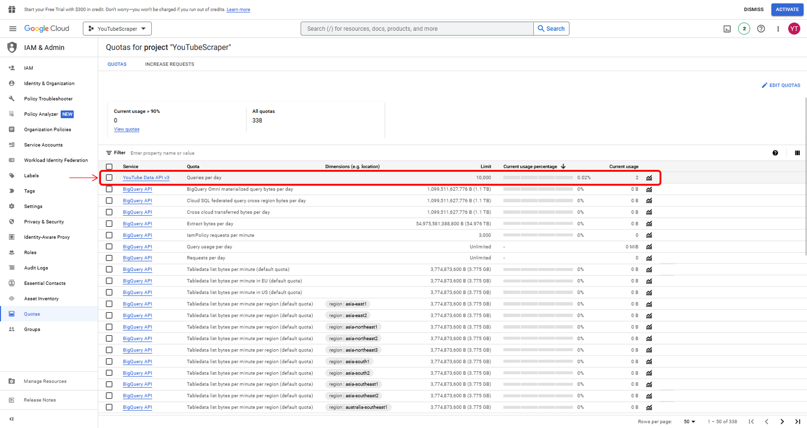

```{r child = "./content/config/exercises_setup.Rmd"}
```


```{block, box.title = "Exercise 1", box.body = list(fill = "white"), box.icon = "fa-star"}
If you have not done so before, set up your YouTube API Access in the Google Developer Console and make sure that it’s working. If you already did this before, you can skip this step. If not, you should do it now because we will need API access for the next sections. 
```

```{block, opts.label = "clues", box.icon = "fa-lightbulb"}
Follow the YouTube API Setup tutorial. If you get stuck, feel free to ask us for help. 
```

```{block, box.title = "Exercise 2", box.body = list(fill = "white"), box.icon = "fa-star"}
Go to the YouTube API console and check the amount of requests you already made for the app you are using.  
```

```{block, opts.label = "clues", box.icon = "fa-lightbulb"}
You can do this by going to the [Developer Console](https://console.cloud.google.com/home/dashboard) and logging in with the Google account you used for creating the app for your API access. On the top left, next to the “Google Cloud Platform” logo, you can click the three lines to open up a menu. In this menu, go to “IAM & Admin” and click in the second to last item in the “IAM & Admin” section, called “Quotas”. Make sure that you have selected the right project.
```


```{block, box.title = "Solution", solution = TRUE, box.icon = "fa-check"}

```

```{block, box.title = "Exercise 3", box.body = list(fill = "white"), box.icon = "fa-star"}
Go to the _YouTube_ quota calculator and calculate the resources needed for the following scenarios:

- _search_ videos with the _list_ method

- get statistics for _videos_ with the _list_ method

- get statistics for _playlistItems_ with the _list_ method 
```

```{block, opts.label = "clues", box.icon = "fa-lightbulb"}
You can find the quota calculator [here](https://developers.google.com/youtube/v3/determine_quota_cost) and need to look for the right resource and method. The quota cost of **one** such call is displayed on the right side.
```


```{block, box.title = "Solution", solution = TRUE, box.icon = "fa-check"}
- 100 units _per page_ of results

- 1 unit _per page_ of results

- 1 unit _per page_ of results
```

```{block, box.title = "Exercise 4", box.body = list(fill = "white"), box.icon = "fa-star"}
Construct and make an API call (either in your console, your browser or in `R`) to get data with the following parameters:

- Get information from the items in the following *YouTube* playlist: https://www.youtube.com/playlist?list=PLv4AV-dc1b8UaR3BP0ldhTcy9p0ysTEwy

- Request a _snippet_ containing information about playlist items

- Limit your maximum number of results to 10 
```

```{block, opts.label = "clues", box.icon = "fa-lightbulb"}
- It's probably helpful to go back to the slide explaining the general structure of API calls.

- You can look up the names and proper use of different API resources in the [documentation](https://developers.google.com/youtube/v3/docs) on the left side

- You need to use the _PlaylistItem_ resource, not the _Playlists_ resource

- You can check out the correct parameter names in the [documentation of the resource](https://developers.google.com/youtube/v3/docs/playlistItems/list)

You can execute your API call:

 - directly in the console on Linux/Mac using [curl](https://linuxize.com/post/curl-command-examples/)
 
 - from R using the packages [curl](https://cran.r-project.org/web/packages/curl/vignettes/intro.html) and [jsonlite](https://cran.r-project.org/web/packages/jsonlite/index.html)
 
 - In your browser by simply inserting the API call into the URL field
 
Do not forget to authenticate your API request by adding your _API key_ at the end
```


```{block, box.title = "Solution", solution = TRUE, box.icon = "fa-check"}
*In the browser*

Just enter "ht<!-- -->tps://youtube.<!-- -->googleapis.com/youtube/v3/playlistItems?part=snippet&maxResults=10&playlistId=PLv4AV-dc1b8UaR3BP0ldhTcy9p0ysTEwy&key=INSERT-API-KEY-HERE" in the URL window and insert your API key

*API call from console:*

curl "ht<!-- -->tps://youtube.<!-- -->googleapis.com/youtube/v3/playlistItems?part=snippet&maxResults=10&playlistId=PLv4AV-dc1b8UaR3BP0ldhTcy9p0ysTEwy&key=INSERT-API-KEY-HERE"


*API call from R:* 

library(curl) <br>
library(jsonlite) <br>
api_response <- fromJSON(curl("ht<!-- -->tps://www.<!-- -->googleapis.com/ <br>
                                &nbsp;&nbsp;&nbsp;youtube/v3/playlistItems? <br>
                                &nbsp;&nbsp;&nbsp;part=snippet&maxResults=10& <br>
                                &nbsp;&nbsp;&nbsp;playlistId=PLv4AV-dc1b8UaR3BP0ldhTcy9p0ysTEwy& <br>
                                &nbsp;&nbsp;&nbsp;key=INSERT-API-KEY-HERE")) <br>

```

```{block, box.title = "Solution", solution = TRUE, box.icon = "fa-check", tidy=FALSE}
Your result should look somewhat like this:

```{json}{
  "kind": "youtube#playlistItemListResponse",
  "etag": "dS3B7gKDnxecWMgOQx-FaAIF0f8",
  "nextPageToken": "EAAaBlBUOkNBbw",
  "items": [
    {
      "kind": "youtube#playlistItem",
      "etag": "WnXDdikrBeeSTXk6va55QsV01uo",
      "id": "UEx2NEFWLWRjMWI4VWFSM0JQMGxkaFRjeTlwMHlzVEV3eS4wMTcyMDhGQUE4NTIzM0Y5",
      "snippet": {
        "publishedAt": "2021-08-05T09:21:21Z",
        "channelId": "UCiQ98odXlAkX63EaFWNjH0g",
        "title": "Meet the Experts: Dr. K. Weller: Introducing Computational Social Science & Digital Behavioral Data",
        "description": "This talk will provide an introductory overview of the emergence of computational social science (CSS) as a new research area combining multidisciplinary methods and new types of data that promise to be valuable complements to surveys. The term digital behavioral data summarizes a broad variety of data captured by web-based platforms (most prominently platforms for online communication, but also e.g. shopping portals or dating sites) and other digital technologies like smartphones, fitness devices, or RFID sensors. Digital behavioral data result from traces that humans are leaving when using these platforms, i.e. the data is typically not a direct product of a scientifically predesigned research setup.\n\nThe talk showcases examples of digital behavioral data and how they have been used in past CSS research to learn about or predict behavior, characteristics, or opinions of platform users. It provides the basis for a series of talks from the area of CSS that will take a closer look at individual strategies for collecting digital behavioral data, different methods data analysis and different use cases for social science research.\n\nSpeaker:\nDr. Katrin Weller  leads the team Social Analytics and Services and is deputy head of the Computational Social Science department at GESIS. She holds a PhD in information science and is interested in understanding scientific communication structures in online environments. Her work also questions data archiving and sharing surrounding social media data. She was Digital Studies Fellow at the US Library of Congress.\n\nCited/recommended literature:\n\nCioffi-Revilla, C. (2014). Introduction to computational social science. London and Heidelberg: Springer. https://doi.org/10.1007/978-3-319-50131-4 \nGilbert, E., & Karahalios, K. (2009). Predicting tie strength with social media. ACM Conference on Human Factors in Computing Systems - CHI '09, 211–220. https://doi.org/10.1145/1518701.1518736 \nJean, N., Burke, M., Xie, M., Davis, W. M., Lobell, D. B., & Ermon, S. (2016). Combining satellite imagery and machine learning to predict poverty. Science, 353(6301), 790–794. https://doi.org/10.1126/science.aaf7894 \nJungherr, A., Jürgens, P., & Schoen, H. (2012). Why the pirate party won the german election of 2009 or the trouble with predictions: A response to Tumasjan, A., Sprenger, T.O., Sander, P.G., & Welpe, I.M. “Predicting elections with twitter: What 140 characters reveal about political sentiment”. Social science computer review, 30(2), 229-234. https://doi.org/10.1177%2F0894439311404119 \nLazer, D. M., Pentland, A., Watts, D. J., Aral, S., Athey, S., Contractor, N., ... & Wagner, C. (2020). Computational social science: Obstacles and opportunities. Science, 369(6507), 1060-1062. https://doi.org/10.1126/science.aaz8170 \nLazer, D., Pentland, A., Adamic, L., Aral, S., Barabasi, A. L., Brewer, D., ... & Van Alstyne, M. (2009). Social science: Computational social science. Science (New York, NY), 323(5915), 721-723. https://doi.org/10.1126/science.1167742 \nLuhmann, M. (2017). Using Big Data to study subjective well-being. Current Opinion in Behavioral Sciences, 18, 28–33. https://doi.org/10.1016/j.cobeha.2017.07.006 \nOlteanu, A., Castillo, C., Diaz, F., & Kıcıman, E. (2019). Social data: Biases, methodological pitfalls, and ethical boundaries. Frontiers in Big Data, 2, 13. https://doi.org/10.3389/fdata.2019.00013 \nRobards, B., Lyall, B., & Moran, C. (2020). Confessional data selfies and intimate digital traces. New Media & Society, 146144482093403. https://doi.org/10.1177/1461444820934032 \nRuths, D., & Pfeffer, J. (2014). Social media for large studies of behavior. Science, 346(6213), 1063-1064. https://doi.org/10.1126/science.346.6213.1063 \nSalganik, M. J. (2019). Bit by bit: Social research in the digital age. Princeton University Press. \nSnee, H., Hine, C., Morey, Y., Roberts, S., & Watson, H. (2016). Digital methods as mainstream methodology: An introduction. In Digital methods for social science (pp. 1-11). Palgrave Macmillan, London. https://doi.org/10.1057/9781137453662_1 \nStier, S., Breuer, J., Siegers, P., Gummer, T., & Bleier, A. (2019). Enemies of the People: Party cues, populism and selective exposure to news – An investigation combining web tracking and survey data. (Working paper) DVPW und DGPuK PolKomm-Tagung 2019.",
        "thumbnails": {
          "default": {
            "url": "https://i.ytimg.com/vi/R-iqC_3cS80/default.jpg",
            "width": 120,
            "height": 90
          },
          "medium": {
            "url": "https://i.ytimg.com/vi/R-iqC_3cS80/mqdefault.jpg",
            "width": 320,
            "height": 180
          },
          "high": {
            "url": "https://i.ytimg.com/vi/R-iqC_3cS80/hqdefault.jpg",
            "width": 480,
            "height": 360
          }
        },
        "channelTitle": "GESIS - Leibniz-Institut für Sozialwissenschaften",
        "playlistId": "PLv4AV-dc1b8UaR3BP0ldhTcy9p0ysTEwy",
        "position": 0,
        "resourceId": {
          "kind": "youtube#video",
          "videoId": "R-iqC_3cS80"
        },
        "videoOwnerChannelTitle": "GESIS - Leibniz-Institut für Sozialwissenschaften",
        "videoOwnerChannelId": "UCiQ98odXlAkX63EaFWNjH0g"
      }
    },
    {
      "kind": "youtube#playlistItem",
      "etag": "LC5kbNqgnvRaPxYPNemBzhFcEvs",
      "id": "UEx2NEFWLWRjMWI4VWFSM0JQMGxkaFRjeTlwMHlzVEV3eS41NkI0NEY2RDEwNTU3Q0M2",
      "snippet": {
        "publishedAt": "2021-08-05T09:17:23Z",
        "channelId": "UCiQ98odXlAkX63EaFWNjH0g",
        "title": "Meet the Experts: Dr. F. Floeck & I. Sen: Digital traces of human behaviourin online platforms",
        "description": "Peoples’ activities and opinions recorded as digital traces online, especially on social media and other web-based platforms, offer increasingly informative pictures of the public. They promise to allow inferences about populations beyond the users of the platforms on which the traces are recorded, representing real potential for the Social Sciences and a complement to survey-based research. But the use of digital traces brings its own complexities and new error sources to the research enterprise. Recently, researchers have begun to discuss the errors that can occur when digital traces are used to learn about humans and social phenomena.\n\nThis talk discusses various strategies for critical reflection on the limitations, implications, and consequences of using digital traces for measuring social constructs. Inspired by the Total Survey Error (TSE) Framework developed for survey methodology, we introduce a conceptual framework to diagnose, understand, and document errors that may occur in studies based on such digital traces. While there are clear parallels to the well-known error sources in the TSE framework, the new “Total Error Framework for Digital Traces of Human Behavior on Online Platforms” (TED-On) identifies several types of error that are specific to the use of digital traces. By providing a standard vocabulary to describe these errors, the proposed framework and this talk advances communication and research concerning the use of digital traces in scientific social research.\n\nSpeakers:\nDr. Fabian Flöck leads the Data Science team at the Computational Social Science Department at GESIS. He is interested in the validity and transparency of automated measurement in social science contexts, but also researches interactive data analysis services, collaborative content creation and digital communication processes. He studied communication sciences and sociology, and subsequently acquired a PhD in computer science.\n\nIndira Sen is a doctoral candidate at GESIS, working at the intersection of Computational Social Science and Natural Language Processing. She has a bachelor’s and master's degree in Computer Science, and currently works on measuring social constructs like political attitudes and hate speech from social media data and understanding the limitations inherent to this task.\n\nCited/recommended literature:\n\nGroves, R. M., Fowler Jr, F. J., Couper, M. P., Lepkowski, J. M., Singer, E., & Tourangeau, R. (2011). Survey methodology (Vol. 561). John Wiley & Sons. \nSen, I., Flöck, F., Weller, K., Weiß, B., & Wagner, C. (2021). A total error framework for digital traces of human behavior on online platforms. Public Opinion Quarterly, 85(S1), 399-422. https://doi.org/10.1093/poq/nfab018 \nLazer, D., Kennedy, R., King, G., & Vespignani, A. (2014). The parable of Google Flu: traps in big data analysis. Science, 343(6176), 1203-1205. https://doi.org/10.1126/science.1248506",
        "thumbnails": {
          "default": {
            "url": "https://i.ytimg.com/vi/y9mVuQnXWec/default.jpg",
            "width": 120,
            "height": 90
          },
          "medium": {
            "url": "https://i.ytimg.com/vi/y9mVuQnXWec/mqdefault.jpg",
            "width": 320,
            "height": 180
          },
          "high": {
            "url": "https://i.ytimg.com/vi/y9mVuQnXWec/hqdefault.jpg",
            "width": 480,
            "height": 360
          },
          "standard": {
            "url": "https://i.ytimg.com/vi/y9mVuQnXWec/sddefault.jpg",
            "width": 640,
            "height": 480
          },
          "maxres": {
            "url": "https://i.ytimg.com/vi/y9mVuQnXWec/maxresdefault.jpg",
            "width": 1280,
            "height": 720
          }
        },
        "channelTitle": "GESIS - Leibniz-Institut für Sozialwissenschaften",
        "playlistId": "PLv4AV-dc1b8UaR3BP0ldhTcy9p0ysTEwy",
        "position": 1,
        "resourceId": {
          "kind": "youtube#video",
          "videoId": "y9mVuQnXWec"
        },
        "videoOwnerChannelTitle": "GESIS - Leibniz-Institut für Sozialwissenschaften",
        "videoOwnerChannelId": "UCiQ98odXlAkX63EaFWNjH0g"
      }
    },
    {
      "kind": "youtube#playlistItem",
      "etag": "uoWMm5UQEUDhUTe9uepvQYqEjjI",
      "id": "UEx2NEFWLWRjMWI4VWFSM0JQMGxkaFRjeTlwMHlzVEV3eS4yODlGNEE0NkRGMEEzMEQy",
      "snippet": {
        "publishedAt": "2021-08-05T09:18:00Z",
        "channelId": "UCiQ98odXlAkX63EaFWNjH0g",
        "title": "Meet the Experts: Dr. J. Breuer & Dr. S. Stier: Combining survey data and digital behavioral data",
        "description": "The use of digital behavioral data (DBD) is one of the key features of computational social science. These data have several advantages compared to other types of data, such as survey data. For example, DBD are generally less costly to collect and less prone to being influenced by social desirability than survey data, and they allow for capturing behavior immediately when it occurs instead of ex-post, thus, reducing problems related to recall. At the same time, however, DBD also have specific limitations. These include a lack of information about the individuals (e.g., regarding their demographics, personality traits, or attitudes) or the fact that they provide only limited information about offline activities. Yet the measurement of individual attributes and attitudes as well as self-reported behaviors across domains is what surveys are well-suited for. Combining survey data and DBD therefore leverages the unique strengths of these two data types, while also addressing some of their respective limitations.\n\nThis talk discusses the benefits of combining survey data with DBD and the challenges associated with this approach. We will present different ways of linking surveys and DBD and address key challenges regarding linking procedures, informed consent, and data privacy.\n\nSpeakers:\nDr. Johannes Breuer is as a senior researcher in the team Data Linking & Data Security at GESIS where his work focuses on data linking and the use of digital trace data. He holds a Ph.D. in psychology and his research interests include the use and effects of digital media, computational methods, data management, and open science.\n\nDr. Sebastian Stier is a senior researcher in the Computational Social Science department at GESIS. He holds a PhD in political science and conducts research in the fields of political communication, comparative politics, and computational social science.\n\nCited literature:\nHowison, J., Wiggins, A., & Crowston, K. (2011). Validity issues in the use of social network analysis with digital trace data. Journal of the Association for Information Systems, 12(12), 2. https://doi.org/10.17705/1jais.00282\nStier, S., Breuer, J., Siegers, P., & Thorson, K. (2020). Integrating Survey Data and Digital Trace Data: Key Issues in Developing an Emerging Field. Social Science Computer Review, 38(5), 503–516. https://doi.org/10.1177/0894439319843669\nParry, D. A., Davidson, B. I., Sewall, C. J., Fisher, J. T., Mieczkowski, H., & Quintana, D. S. (2021). A systematic review and meta-analysis of discrepancies between logged and self-reported digital media use. Nature Human Behaviour, 1-13. https://doi.org/10.1038/s41562-021-01117-5\nConover, M. D., Ratkiewicz, J., Francisco, M., Gonçalves, B., Menczer, F., & Flammini, A. (2011). Political polarization on twitter. In Fifth international AAAI conference on weblogs and social media (pp. 89-96). https://ojs.aaai.org/index.php/ICWSM/article/view/14126\nGuess, A. M. (2021). (Almost) Everything in Moderation: New Evidence on Americans’ Online Media Diets. American Journal of Political Science, 65(4), 1007-1022. https://doi.org/10.1111/ajps.12589\nNelson, J. L., & Webster, J. G. (2017). The Myth of Partisan Selective Exposure: A Portrait of the Online Political News Audience. Social Media + Society, 3(3). https://doi.org/10.1177/2056305117729314\nResnick, P., Adar, E., & Lampe, C. (2015). What Social Media Data We Are Missing and How to Get It. The ANNALS of the American Academy of Political and Social Science, 659(1), 192–206. https://doi.org/10.1177/0002716215570006\nSen, I., Flöck, F., Weller, K., Weiß, B., & Wagner, C. (2021). A total error framework for digital traces of human behavior on online platforms. Public Opinion Quarterly, 85(S1), 399-422. https://doi.org/10.1093/poq/nfab018\nBreuer, J., Al Baghal, T., Sloan, L., Bishop, L., Kondyli, D., & Linardis, A. (2021). Informed consent for linking survey and social media data - Differences between platforms and data types. IASSIST Quarterly, 45(1). https://doi.org/10.29173/iq988",
        "thumbnails": {
          "default": {
            "url": "https://i.ytimg.com/vi/K9AORhJMjeY/default.jpg",
            "width": 120,
            "height": 90
          },
          "medium": {
            "url": "https://i.ytimg.com/vi/K9AORhJMjeY/mqdefault.jpg",
            "width": 320,
            "height": 180
          },
          "high": {
            "url": "https://i.ytimg.com/vi/K9AORhJMjeY/hqdefault.jpg",
            "width": 480,
            "height": 360
          }
        },
        "channelTitle": "GESIS - Leibniz-Institut für Sozialwissenschaften",
        "playlistId": "PLv4AV-dc1b8UaR3BP0ldhTcy9p0ysTEwy",
        "position": 2,
        "resourceId": {
          "kind": "youtube#video",
          "videoId": "K9AORhJMjeY"
        },
        "videoOwnerChannelTitle": "GESIS - Leibniz-Institut für Sozialwissenschaften",
        "videoOwnerChannelId": "UCiQ98odXlAkX63EaFWNjH0g"
      }
    },
    {
      "kind": "youtube#playlistItem",
      "etag": "8hIGCslWrQyrICV_piXay6EKQdo",
      "id": "UEx2NEFWLWRjMWI4VWFSM0JQMGxkaFRjeTlwMHlzVEV3eS41MjE1MkI0OTQ2QzJGNzNG",
      "snippet": {
        "publishedAt": "2021-09-27T08:28:01Z",
        "channelId": "UCiQ98odXlAkX63EaFWNjH0g",
        "title": "Meet the Experts: Dr. K. Weller & O. Watteler: Ethics and Data Protection in Social Media Research",
        "description": "Information from social media and other web platforms are collected and used as a new type of research data across academic disciplines. Examples are the study of online communication or learning about users’ behaviors and opinions. While this promises numerous research opportunities, it not only leads to novel methodological challenges, but also raises various questions about research ethics and data protection. By now some guidance exists for researchers who study social media communication, e.g., material offered by professional research associations. But there is still a lot of work in progress and standards or best practices may not exist for every case. With this presentation we give a starting point to reflect upon critical questions when working with this new type of research data and point out useful resources as references.\n\nThe presentation will shed light on how researchers, social media platforms and users are entangled in complex relations that contribute to the challenges of research ethics. A specific focus will be placed on data protection as a core concept. Exemplary research scenarios will be used to illustrate critical questions along different phases in a prototypical research process.\n\nSpeakers:\nDr. Katrin Weller leads the team Social Analytics and Services and is deputy head of the Computational Social Science department at GESIS. She holds a PhD in information science and is interested in understanding scientific communication structures in online environments. Her work also questions data archiving and sharing surrounding social media data. She was Digital Studies Fellow at the US Library of Congress.\n\nOliver Watteler is a senior researcher at GESIS – Leibniz Institute for the Social Sciences, where he works in the department Data Services for the Social Sciences (DSS). He holds a master's degree in history and political science and is responsible for data acquisition. Together with colleagues he advises and trains on topics of research data management. His focus is on legal conditions of RDM, especially data protection, on which he also publishes. He is a member of the Leibniz Association's Data Protection Working Group and vice member of the GESIS Ethics Committee.\n\nCited literature: \n\nFiesler, C., & Proferes, N. (2018). “Participant” Perceptions of Twitter Research Ethics. Social Media + Society, 4(1), 205630511876336. https://doi.org/10.1177/2056305118763366 \nEskisabel-Azpiazu, A., Cerezo-Menéndez, R., & Gayo-Avello, D. (2017). An ethical inquiry into youth suicide prevention using social media mining. Internet Research Ethics for the Social Age, 227. https://static1.squarespace.com/static/57efc8e020099ef24d19f28a/t/5a1f15549140b78aac0770de/1511986552488/360717441-Internet-Research-Ethics-for-the-Social-Age-New-Challenges-Cases-and-Contexts-Full.pdf#page=263 \nFerguson, R. D. (2017). Negotiating Consent, Compensation, and Privacy in Internet Research. Internet Research Ethics for the Social Age, 269. http://www.christinehowes.com/papers/Zimmer&Kinder_book_CC_license.pdf#page=305 \nBuolamwini, J., & Gebru, T. (2018). Gender shades: Intersectional accuracy disparities in commercial gender classification. In Conference on fairness, accountability and transparency (pp. 77–91). http://proceedings.mlr.press/v81/buolamwini18a/buolamwini18a.pdf \nWachter, S. & Mittelstadt, B. (2018). A Right to Reasonable Inferences: Re-Thinking Data Protection Law in the Age of Big Data and AI. Columbia Business Law Review, 2, 443-493. https://academiccommons.columbia.edu/doi/10.7916/d8-g10s-ka92 \nZimmer, M. (2010). “But the data is already public”: On the ethics of research in Facebook. Ethics and Information Technology, 12(4), 313–325. https://doi.org/10.4324/9781003075011-17 \nZimmer, M. (2016). OkCupid Study Reveals the Perils of Big-Data Science. https://www.wired.com/2016/05/okcupid-study-reveals-perils-big-data-science/ \nKirkegaard, EOW, & Bjerrekær, J. (2016). The OKCupid dataset: A very large public dataset of dating site users. Open Differential Psychology, Nov. 2, 2016. https://openpsych.net/paper/46",
        "thumbnails": {
          "default": {
            "url": "https://i.ytimg.com/vi/T6q-IcPY8GE/default.jpg",
            "width": 120,
            "height": 90
          },
          "medium": {
            "url": "https://i.ytimg.com/vi/T6q-IcPY8GE/mqdefault.jpg",
            "width": 320,
            "height": 180
          },
          "high": {
            "url": "https://i.ytimg.com/vi/T6q-IcPY8GE/hqdefault.jpg",
            "width": 480,
            "height": 360
          }
        },
        "channelTitle": "GESIS - Leibniz-Institut für Sozialwissenschaften",
        "playlistId": "PLv4AV-dc1b8UaR3BP0ldhTcy9p0ysTEwy",
        "position": 3,
        "resourceId": {
          "kind": "youtube#video",
          "videoId": "T6q-IcPY8GE"
        },
        "videoOwnerChannelTitle": "GESIS - Leibniz-Institut für Sozialwissenschaften",
        "videoOwnerChannelId": "UCiQ98odXlAkX63EaFWNjH0g"
      }
    },
    {
      "kind": "youtube#playlistItem",
      "etag": "iInlaDBYRFdTeVrNPgF3t6JtdEM",
      "id": "UEx2NEFWLWRjMWI4VWFSM0JQMGxkaFRjeTlwMHlzVEV3eS4wOTA3OTZBNzVEMTUzOTMy",
      "snippet": {
        "publishedAt": "2021-10-11T07:03:00Z",
        "channelId": "UCiQ98odXlAkX63EaFWNjH0g",
        "title": "Meet the Experts: Dr. Roberto Ulloa: Introduction to Online Data Acquisition",
        "description": "Scientists from various disciplines increasingly want to include web data in their work. The acquisition of such online data is an essential step in most computational social science research projects. There are multiple ways to collect data from online platforms, such as using web application programming interfaces (web APIs), web scraping, and data donations. Some methods and online platforms are better suited to explore different research questions, and the data that can be obtained vary according to policies and the structure of the platform forcing researchers to balance the alternatives. Therefore, it is important to understand the ecosystem to decide the best way to proceed, also considering the implicit policies that each API imposes in the process. Online data acquisition offers multiple opportunities to address societal questions that would otherwise be impossible to answer, and researchers should be able to easily evaluate the different alternatives taking into consideration their scope and limitations.\n\nThis talk presents methods of collecting online data, illustrates how access varies across different platforms such as Twitter and Crowdtangle, and shows the opportunities that the methods and platforms offer. First, the talk will introduce general web concepts including terminology related to data collection. Then, it will showcase some of the possibilities to access data from online platforms, including direct API (e.g. Twitter), third-party sources (e.g. CrowdTangle) and annotation services (e.g. Amazon Rekognition), as well as examples of how this data has been used to answer different research questions.\n\nSpeaker\nDr. Roberto Ulloa is a postdoctoral researcher at the Computational Social Science department of GESIS. He researches the role of institutions in shaping societies, and online platforms as forms of digital institutions.\n\nCited literature & sources:\nWatteler, O., Weller, K.,. Research Ethics and Data Protection in Social Media. Meet the Experts. https://www.youtube.com/watch?v=T6q-IcPY8GE\nSen et al. (2021) https://doi.org/10.1093/poq/nfab018\nFlöck, F., Sen, I. Digital Traces of Human Behavior from Online Platforms – Research Designs and Error Sources. Meet the Experts. https://www.youtube.com/watch?v=y9mVuQnXWec\nLietz et al. (2014) https://ojs.aaai.org/index.php/ICWSM/article/view/14521\nStier et al. (2018) https://doi.org/10.1080/10584609.2017.1334728\nGLES (2019) https://doi.org/10.4232/1.13213\nBaumgartner et al. (2020) https://ojs.aaai.org/index.php/ICWSM/article/view/7347 \nProferes et al. (2021) https://doi.org/10.1177%2F20563051211019004 \nZagovora et al. (2021) https://doi.org/10.1162/qss_a_00171 \nFlöck & Acosta (2014) https://doi.org/10.1145/2566486.2568026 \nal Nashmi et al. (2017) https://doi.org/10.1080/13216597.2017.1300180 \nAl-Rawi (2019) https://doi.org/10.1080/21670811.2017.1387062 \nBurnap & Williams (2015) https://doi.org/10.1002/poi3.85\nDe Choudhury et al. (2021) https://ojs.aaai.org/index.php/ICWSM/article/view/14432 \nDonzelli et al. (2018) https://doi.org/10.1080/21645515.2018.1454572 \nHeuer et al. (2021) https://doi.org/10.1145/3473856.3473864 \nHussein, Juneja, & Mitra (2020) https://doi.org/10.1145/3392854 \nKhatri et al. (2020) https://doi.org/10.1016/j.tmaid.2020.101636 \nLi et al. (2020) https://doi.org/10.1136/bmjgh-2020-002604 \nNadeem (2016) http://arxiv.org/abs/1607.07384\nObadimu et al. (2019) https://doi.org/10.1007/978-3-030-21741-9_22\nSingh et al. (2020) https://doi.org/10.1016/j.giq.2019.101444\nSoldner et al. (2019) https://doi.org/10.18653/v1/W19-2110\nTomlein et al. (2021) https://doi.org/10.1145/3460231.3474241\nTsugawa et al. (2015) https://doi.org/10.1145/2702123.2702280\nTumasjan et al. (2010) https://doi.org/10.1177/0894439310386557\nWang & Gan (2017) https://doi.org/10.1109/CEEC.2017.8101605\nWatanabe, Bouazizi, & Ohtsuki (2018) https://doi.org/10.1109/ACCESS.2018.2806394\nZagheni et al. (2014) https://doi.org/10.1145/2567948.2576930 \nZhang & Luo (2019) https://doi.org/10.3233/SW-180338",
        "thumbnails": {
          "default": {
            "url": "https://i.ytimg.com/vi/inUvEFLG5EA/default.jpg",
            "width": 120,
            "height": 90
          },
          "medium": {
            "url": "https://i.ytimg.com/vi/inUvEFLG5EA/mqdefault.jpg",
            "width": 320,
            "height": 180
          },
          "high": {
            "url": "https://i.ytimg.com/vi/inUvEFLG5EA/hqdefault.jpg",
            "width": 480,
            "height": 360
          }
        },
        "channelTitle": "GESIS - Leibniz-Institut für Sozialwissenschaften",
        "playlistId": "PLv4AV-dc1b8UaR3BP0ldhTcy9p0ysTEwy",
        "position": 4,
        "resourceId": {
          "kind": "youtube#video",
          "videoId": "inUvEFLG5EA"
        },
        "videoOwnerChannelTitle": "GESIS - Leibniz-Institut für Sozialwissenschaften",
        "videoOwnerChannelId": "UCiQ98odXlAkX63EaFWNjH0g"
      }
    },
    {
      "kind": "youtube#playlistItem",
      "etag": "1XkprsIfr2Ws1xMTfsZjK2lDUyg",
      "id": "UEx2NEFWLWRjMWI4VWFSM0JQMGxkaFRjeTlwMHlzVEV3eS4xMkVGQjNCMUM1N0RFNEUx",
      "snippet": {
        "publishedAt": "2021-10-13T12:41:03Z",
        "channelId": "UCiQ98odXlAkX63EaFWNjH0g",
        "title": "Meet the Experts: Dr. Roberto Ulloa: Auditing Algorithms",
        "description": "In digital environments algorithms play a major and often a decisive role. Algorithm auditing is an important research method for identifying problematic behavior in online platforms (such as social networks, search engines, job matching sales platforms). As these platforms gain influence in society, questions regarding their fairness have been raised. For example, how do algorithms reinforce discrimination against different societal groups? Do recommendation systems lead to polarization and help spread extremists views? Are certain sources favoured by search engines? Multiple auditing approaches have been applied to investigate these questions. Although most of the methods can be applied to relevant social science cases, the use of automated browsing (virtual agents) stands out as a promising venue for a permanent monitoring of algorithmic systems that can be leveraged to keep the companies behind them accountable.\n\nThis talk compares different methods for algorithm auditing, and showcases different results from past investigations. It will focus on a family of methods using virtual agents to systematically scrape online platforms at a large scale, allowing for experimental designs that can control factors that affect algorithms such as different levels of personalization.\n\nSpeaker\nDr. Roberto Ulloa is a postdoctoral researcher at the Computational Social Science department of GESIS. He researches the role of institutions in shaping societies, and online platforms as forms of digital institutions.\n\nCited literature:\n\nNoble (2013) http://hdl.handle.net/1802/28018 \nNoble, S. U. (2018) Algorithms of oppression: How search engines reinforce racism: NYU Press.\nKay, Matuszek, & Munson (2015) https://doi.org/10.1145/2702123.2702520 \nArcher, Iritani, Kimes, & Barrios (1983) https://psycnet.apa.org/doi/10.1037/0022-3514.45.4.725 \nOtterbacher, et al. (2018) https://doi.org/10.1145/3209978.3210094 \nUlloa, R., Richter, A. C., Makhortykh, M., Urman, A., & Kacperski, C. (n.d.). Representativeness and Face-ism: Gender Bias in Image Search. Unpublished Manuscript.\nBuolamwini, & Gebru (2018) http://proceedings.mlr.press/v81/buolamwini18a.html \nHannák, et al. (2017) https://doi.org/10.1145/2998181.2998327 \nChen et al. (2018) https://doi.org/10.1145/3173574.3174225 \nCabañas, Cuevas, & Cuevas (2018) https://www.usenix.org/conference/usenixsecurity18/presentation/cabanas \nHong (2012) https://doi.org/10.1145/2063176.2063197 \nBashir et al. (2019) https://dx.doi.org/10.14722/ndss.2019.23392 \nDatta, Tschantz, & Datta (2015) https://doi.org/10.1515/popets-2015-0007 \nHussein, Juneja, & Mitra (2020) https://doi.org/10.1145/3392854 \nMikians et al. (2012) https://doi.org/10.1145/2390231.2390245 \nHannak et al. (2013) https://doi.org/10.1145/2488388.2488435 \nKliman-Silver et al. (2015) https://doi.org/10.1145/2815675.2815714 \nTrielli, & Diakopoulos (2019) https://doi.org/10.1145/3290605.3300683 \nFischer, Jaidka, & Lelkes (2020) https://doi.org/10.1038/s41562-020-00954-0 \nUrman, Makhortykh, & Ulloa (2021a) https://doi.org/10.1145/3442442.3452306 \nMittelstadt (2016) https://ijoc.org/index.php/ijoc/article/view/6267 \nBandy (2021) https://doi.org/10.1145/3449148 \nSilva et al. (2020) https://doi.org/10.1145/3366423.3380109 \nMakhortykh, Urman, & Ulloa (2020) https://doi.org/10.37016/mr-2020-017 \nMakhortykh, Urman, & Ulloa (2021a) https://doi.org/10.1007/978-3-030-78818-6_5 \nUlloa, Makhortykh, & Urman (2021) https://arxiv.org/abs/2106.05831 \nUrman, Makhortykh, & Ulloa (2021b) https://doi.org/10.1177%2F08944393211006863 \nMakhortykh, Urman, & Ulloa (2021b) https://doi.org/10.5210/fm.v26i10.11562 \nKulshrestha et al. (2017) https://doi.org/10.1145/2998181.2998321",
        "thumbnails": {
          "default": {
            "url": "https://i.ytimg.com/vi/Z0CdPa_80LY/default.jpg",
            "width": 120,
            "height": 90
          },
          "medium": {
            "url": "https://i.ytimg.com/vi/Z0CdPa_80LY/mqdefault.jpg",
            "width": 320,
            "height": 180
          },
          "high": {
            "url": "https://i.ytimg.com/vi/Z0CdPa_80LY/hqdefault.jpg",
            "width": 480,
            "height": 360
          },
          "standard": {
            "url": "https://i.ytimg.com/vi/Z0CdPa_80LY/sddefault.jpg",
            "width": 640,
            "height": 480
          },
          "maxres": {
            "url": "https://i.ytimg.com/vi/Z0CdPa_80LY/maxresdefault.jpg",
            "width": 1280,
            "height": 720
          }
        },
        "channelTitle": "GESIS - Leibniz-Institut für Sozialwissenschaften",
        "playlistId": "PLv4AV-dc1b8UaR3BP0ldhTcy9p0ysTEwy",
        "position": 5,
        "resourceId": {
          "kind": "youtube#video",
          "videoId": "Z0CdPa_80LY"
        },
        "videoOwnerChannelTitle": "GESIS - Leibniz-Institut für Sozialwissenschaften",
        "videoOwnerChannelId": "UCiQ98odXlAkX63EaFWNjH0g"
      }
    },
    {
      "kind": "youtube#playlistItem",
      "etag": "v5wVRn11ORTjeDIuNPJkWlieKT4",
      "id": "UEx2NEFWLWRjMWI4VWFSM0JQMGxkaFRjeTlwMHlzVEV3eS41MzJCQjBCNDIyRkJDN0VD",
      "snippet": {
        "publishedAt": "2021-10-19T12:46:42Z",
        "channelId": "UCiQ98odXlAkX63EaFWNjH0g",
        "title": "Meet the Experts: M. Sältzer & Dr. S. Stier: The German Federal Election: Social Media Data …",
        "description": "Social media have developed into important arenas for political debate and strategic communication by political actors. For social scientists, observing political communication over party competition and social media behavior of elites and regular citizens alike allows for drawing inferences about new political phenomena and longstanding research questions. In particular, a systematic monitoring of political campaigns and elections provides a high number of observations with a fine-grained granularity at a limited cost, when compared to population surveys.\n\nHowever, research on social media comes with its own set of challenges, from collecting to storing, filtering, coding and interpreting the resulting large data sets. In this session, we elaborate on five best practices: the identification and validation of the target population, the most efficient and legal collection of data using APIs and open source tools, the design of databases to store these types of data, efficient ways to put humans in the loop for coding and validation, and finally, the management and maintenance of these processes.\n\nSpeakers\nDr. Marius Sältzer is a Postdoctoral researcher at GESIS CSS in the Project “Negative Campaigning in German Elections in Social Media”. He received his PhD from University of Mannheim on how political elites use social media to signal their positions and priorities to the electorate and other political actors. His research revolves around the dimensions of political conflict in political communication; methodologically Marius focuses on Text-as-Data.\n\nDr. Sebastian Stier is a senior researcher in the Computational Social Science department at GESIS. He holds a PhD in political science and conducts research in the fields of political communication, comparative politics, and computational social science.\n\nCited literature:\n\nGLES (2019). Langfrist-Online-Tracking, Kumulation 2009-2017 (GLES). GESIS Datenarchiv, Köln. ZA6832 Datenfile Version 1.1.0. https://doi.org/10.4232/1.13416.\nStier, S., Bleier, A., Bonart, M., Mörsheim, F., Bohlouli, M., Nizhegorodov, M., Posch, L., Maier, J., Rothmund, T., & Staab, S. (2018). Social Media Monitoring for the German federal election 2017. GESIS Data Archive, Cologne. ZA6926 Data file Version 1.0.0. https://doi.org/10.4232/1.12992\nKaczmirek, L. & Mayr, P. (2015). German Bundestag Elections 2013: Twitter Usage by Electoral Candidates. GESIS Data Archive, Cologne. ZA5973 Data file Version 1.0.0. https://doi.org/10.4232/1.12319\nSältzer, M., Stier, S., Bäuerle, J., Blumenberg, M., Mechkova, V., Pemstein, D., Seim, B., & Wilson, S. (2021). Twitter-Accounts der Kandidierenden zur Bundestagswahl 2021 (GLES). GESIS Datenarchiv, Köln. ZA7721 Datenfile Version 2.0.0., https://doi.org/10.4232/1.13790\nStier, S., Popa, S. A., & Braun, D. (2020). Political Campaigning on Twitter During the 2019 European Parliament Election Campaign. GESIS - Leibniz Institut für Sozialwissenschaften. Datenfile Version 1.0.0. https://doi.org/10.7802/1.1995.",
        "thumbnails": {
          "default": {
            "url": "https://i.ytimg.com/vi/Vy5ZXW8p5g4/default.jpg",
            "width": 120,
            "height": 90
          },
          "medium": {
            "url": "https://i.ytimg.com/vi/Vy5ZXW8p5g4/mqdefault.jpg",
            "width": 320,
            "height": 180
          },
          "high": {
            "url": "https://i.ytimg.com/vi/Vy5ZXW8p5g4/hqdefault.jpg",
            "width": 480,
            "height": 360
          },
          "standard": {
            "url": "https://i.ytimg.com/vi/Vy5ZXW8p5g4/sddefault.jpg",
            "width": 640,
            "height": 480
          },
          "maxres": {
            "url": "https://i.ytimg.com/vi/Vy5ZXW8p5g4/maxresdefault.jpg",
            "width": 1280,
            "height": 720
          }
        },
        "channelTitle": "GESIS - Leibniz-Institut für Sozialwissenschaften",
        "playlistId": "PLv4AV-dc1b8UaR3BP0ldhTcy9p0ysTEwy",
        "position": 6,
        "resourceId": {
          "kind": "youtube#video",
          "videoId": "Vy5ZXW8p5g4"
        },
        "videoOwnerChannelTitle": "GESIS - Leibniz-Institut für Sozialwissenschaften",
        "videoOwnerChannelId": "UCiQ98odXlAkX63EaFWNjH0g"
      }
    },
    {
      "kind": "youtube#playlistItem",
      "etag": "P3VSGH4pSlUmK9hx9Ltad3u7aco",
      "id": "UEx2NEFWLWRjMWI4VWFSM0JQMGxkaFRjeTlwMHlzVEV3eS5DQUNERDQ2NkIzRUQxNTY1",
      "snippet": {
        "publishedAt": "2021-11-09T13:32:35Z",
        "channelId": "UCiQ98odXlAkX63EaFWNjH0g",
        "title": "Meet the Experts: Dr. Arnim Bleier: Introduction to Text Mining",
        "description": "Language is the essence of our social life, and its use is at the center of many phenomena, studied by computational social scientists and political communication researchers alike. Examples include opinion dynamics, political polarization, or the biased representation and discrimination of social groups. The statistical analysis of large text corpora from traditional news and social media platforms greatly extends our methodological toolkit to study these phenomena. \n\nIn this talk, Arnim Bleier gives an overview of the use of text as data and corpus statistics in the social sciences. The session will provide an introduction to areas of natural language processing such as feature extraction and supervised as well as unsupervised modeling of text. \n\nSpeaker:\nDr. Arnim Bleier is a postdoctoral researcher in the Department Computational Social Science at GESIS. His research interests are in the field of Computational Social Science, with an emphasis on natural language processing and reproducible research. In collaboration with social scientists, he develops models for the content, structure, and dynamics of social phenomena.\n\nRecommended literature:\n\nStier, S., Posch, L., Bleier, A., & Strohmaier, M. (2017). When populists become popular: Comparing Facebook use by the right-wing movement Pegida and German political parties. Information, Communication & Society, 20(9), 1365-1388. https://doi.org/10.1080/1369118X.2017.1328519 \nGroves, R. M., & Lyberg, L. (2010). Total survey error: Past, present, and future. Public opinion quarterly, 74(5), 849-879. https://doi.org/10.1093/poq/nfq065 \nManning, C., & Schutze, H. (1999). Foundations of statistical natural language processing. MIT press.",
        "thumbnails": {
          "default": {
            "url": "https://i.ytimg.com/vi/AyniSSU-5Xg/default.jpg",
            "width": 120,
            "height": 90
          },
          "medium": {
            "url": "https://i.ytimg.com/vi/AyniSSU-5Xg/mqdefault.jpg",
            "width": 320,
            "height": 180
          },
          "high": {
            "url": "https://i.ytimg.com/vi/AyniSSU-5Xg/hqdefault.jpg",
            "width": 480,
            "height": 360
          },
          "standard": {
            "url": "https://i.ytimg.com/vi/AyniSSU-5Xg/sddefault.jpg",
            "width": 640,
            "height": 480
          },
          "maxres": {
            "url": "https://i.ytimg.com/vi/AyniSSU-5Xg/maxresdefault.jpg",
            "width": 1280,
            "height": 720
          }
        },
        "channelTitle": "GESIS - Leibniz-Institut für Sozialwissenschaften",
        "playlistId": "PLv4AV-dc1b8UaR3BP0ldhTcy9p0ysTEwy",
        "position": 7,
        "resourceId": {
          "kind": "youtube#video",
          "videoId": "AyniSSU-5Xg"
        },
        "videoOwnerChannelTitle": "GESIS - Leibniz-Institut für Sozialwissenschaften",
        "videoOwnerChannelId": "UCiQ98odXlAkX63EaFWNjH0g"
      }
    },
    {
      "kind": "youtube#playlistItem",
      "etag": "CtCBwfiETBs6tIJ7Vg41WVCzBB4",
      "id": "UEx2NEFWLWRjMWI4VWFSM0JQMGxkaFRjeTlwMHlzVEV3eS45NDk1REZENzhEMzU5MDQz",
      "snippet": {
        "publishedAt": "2021-12-01T08:48:53Z",
        "channelId": "UCiQ98odXlAkX63EaFWNjH0g",
        "title": "Meet the Experts: Dr. Haiko Lietz: Social Network Analysis with Digital Behavioral Data",
        "description": "Our uses of digital technologies like social media platforms, email, or cell phones leave massive amounts of behavioral traces that are most interesting for social research. Such Digital Behavioral Data (DBD) consists of genuinely relational records. It requires a shift of perspective from persons to micro events as units of observation and brings established techniques like Social Network Analysis to center stage. In this presentation, I will briefly revisit the history and philosophy of Social Network Analysis, propose a definition of DBD, and characterize it as records of transactions. Next, I will discuss two application scenarios. First, DBD enables socio-semantic analysis, that is, the combined study of social relations and communicative content. Second, it enables mechanistic modeling, that is, the search for feedback processes among micro and macro levels of human behavior. Both kinds of research rest on transcending the individual as the unit of observation, turning towards transactions, and reconstructing emerging patterns. I will close with thoughts about methodological challenges and the significance of relational theories for the consolidation of Computational Social Science.\n\nSpeaker:\nDr. Haiko Lietz is a postdoc at GESIS – Leibniz Institute for the Social Sciences, Cologne, Germany. His research interests lie in applying and developing relational theory and methodology by integrating sociology, complexity theory, and computational approaches.\n\nCited literature:\n\nFreeman, L. (2004). The development of social network analysis. A Study in the Sociology of Science, 1(687), 159-167. \nKossinets, G., & Watts, D. J. (2009). Origins of homophily in an evolving social network. American Journal of Sociology, 115(2), 405-450. https://doi.org/10.1086/599247 \nBurt, R. S. (1992). Structural holes. Harvard university press. https://doi.org/10.4159/9780674029095\nGranovetter, M. S. (1973). The strength of weak ties. American Journal of Sociology, 78(6), 1360-1380. https://doi.org/10.1086/225469 \nCallon, M., Courtial, J. P., Turner, W. A., & Bauin, S. (1983). From translations to problematic networks: An introduction to co-word analysis. Social Science Information, 22(2), 191-235. https://doi.org/10.1177%2F053901883022002003 \nFuhse, J., Stuhler, O., Riebling, J., & Martin, J. L. (2020). Relating social and symbolic relations in quantitative text analysis. A study of parliamentary discourse in the Weimar Republic. Poetics, 78, 101363. https://doi.org/10.1016/j.poetic.2019.04.004 \nEmirbayer, M. (1997). Manifesto for a relational sociology. American journal of sociology, 103(2), 281-317. https://doi.org/10.1086/231209 \nWatts, D. J. (2011). Everything is obvious: Once you know the answer. Crown Business. \nHowison, J., Wiggins, A., & Crowston, K. (2011). Validity issues in the use of social network analysis with digital trace data. Journal of the Association for Information Systems, 12(12), 767-797. http://doi.org/10.17705/1jais.00282 \nLazer, D., & Radford, J. (2017). Data ex machina: introduction to big data. Annual Review of Sociology, 43 (1), 19-39. https://doi.org/10.1146/annurev-soc-060116-053457 \nLietz, H., Wagner, C., Bleier, A., & Strohmaier, M. (2014). When Politicians Talk: Assessing Online Conversational Practices of Political Parties on Twitter. Proceedings of the International AAAI Conference on Web and Social Media, 8(1), 285-294. Retrieved from https://ojs.aaai.org/index.php/ICWSM/article/view/14521 \nGranovetter, M. (1985). Economic Action and Social Structure: The Problem of Embeddedness. American Journal of Sociology, 91(3), 481–510. http://www.jstor.org/stable/2780199 \nHedstrom, P. (2005). Dissecting the social: On the principles of analytical sociology. Cambridge University Press.",
        "thumbnails": {
          "default": {
            "url": "https://i.ytimg.com/vi/FniNS0yZ24E/default.jpg",
            "width": 120,
            "height": 90
          },
          "medium": {
            "url": "https://i.ytimg.com/vi/FniNS0yZ24E/mqdefault.jpg",
            "width": 320,
            "height": 180
          },
          "high": {
            "url": "https://i.ytimg.com/vi/FniNS0yZ24E/hqdefault.jpg",
            "width": 480,
            "height": 360
          },
          "standard": {
            "url": "https://i.ytimg.com/vi/FniNS0yZ24E/sddefault.jpg",
            "width": 640,
            "height": 480
          },
          "maxres": {
            "url": "https://i.ytimg.com/vi/FniNS0yZ24E/maxresdefault.jpg",
            "width": 1280,
            "height": 720
          }
        },
        "channelTitle": "GESIS - Leibniz-Institut für Sozialwissenschaften",
        "playlistId": "PLv4AV-dc1b8UaR3BP0ldhTcy9p0ysTEwy",
        "position": 8,
        "resourceId": {
          "kind": "youtube#video",
          "videoId": "FniNS0yZ24E"
        },
        "videoOwnerChannelTitle": "GESIS - Leibniz-Institut für Sozialwissenschaften",
        "videoOwnerChannelId": "UCiQ98odXlAkX63EaFWNjH0g"
      }
    },
    {
      "kind": "youtube#playlistItem",
      "etag": "WKJraR8xcJwV2dqiNLFS5T0KhLA",
      "id": "UEx2NEFWLWRjMWI4VWFSM0JQMGxkaFRjeTlwMHlzVEV3eS5GNjNDRDREMDQxOThCMDQ2",
      "snippet": {
        "publishedAt": "2021-12-10T10:41:28Z",
        "channelId": "UCiQ98odXlAkX63EaFWNjH0g",
        "title": "Meet the Experts: Olga Zagovora & Dr. Katrin Weller: Altmetrics",
        "description": "Altmetrics – Analyzing Academic Communications from Social Media Data\n\nCitation indexes have been used during the last years as an instrument to measure the scientific success of researchers. Although, they have been criticized for not showing immediate impact and for not being suited to assess the impact of non-traditional contents, like survey and research data or computer software and tools. Therefore, alternative metrics (altmetrics) to measure scientific impact and success are being explored. These new measures are often based on online news media, reference managers, and social media networks, including social bookmarking systems.\n\nThe presentation will shed light on existing aggregators of altmetrics from social media data and how these indicators can be used. Additionally, we will showcase some of the possibilities of indicators collected from Wikipedia and YouTube, as well as the challenges that occur with the data collection and interpretation.\n\nSpeakers:\nOlga Zagovora is a doctoral candidate at the Computational Social Science department at GESIS. Prior to joining GESIS, she studied computer science, web and data science. Her research focuses on the evaluation of alternative metrics for measuring scholarly communication and scientific impact. She has experience working with big data for social science research.\n\nDr. Katrin Weller leads the team Social Analytics and Services and is deputy head of the Computational Social Science department at GESIS. She holds a PhD in information science and is interested in understanding scientific communication structures in online environments. Her work also questions data archiving and sharing surrounding social media data. She was Digital Studies Fellow at the US Library of Congress.\n\nCited/recommended literature:\n\nPan, R., Kaski, K. & Fortunato, S. World citation and collaboration networks: uncovering the role of geography in science. Sci Rep 2, 902 (2012). https://doi.org/10.1038/srep00902 \nWagner, C., Zagovora, O., Sennikova, T., & Karimi, F. (2018). Collective attention towards scientists and research topics. Proceedings of the 10th ACM Conference on Web Science  - WebSci ’18, 11–15. https://doi.org/10.1145/3201064.3201097\nZagovora, O., & Weller, K. (2018). YouTube videos as a place for public discussion of science? The 2018 Altmetrics Workshop, 1–16. http://altmetrics.org/wp-content/uploads/2018/04/altmetrics18_paper_8_Zagovora.pdf\nYan K-K, Gerstein M (2011) The spread of scientific information: Insights from the web usage statistics in PLoS article-level metrics. PLoS ONE 6(5): e19917. https://doi.org/10.1371/journal.pone.0019917 \nZahedi, Z., & Costas, R. (2018). General discussion of data quality challenges in social media metrics: Extensive comparison of four major altmetric data aggregators. PLOS ONE, 13(5), e0197326. https://doi.org/10.1371/journal.pone.0197326\nLemke, S., Zagovora, O., Weller, K., Orth, A., Beucke, D., Stropel, J., & Peters, I. (2020). *metrics: Recommendations from the DFG *metrics project for “Measuring The Reliability and perceptions of Indicators for interactions with scientific products”. DINI Schriften 19-en. Deutsche Initiative für Netzwerkinformationen e.V. https://doi.org/10.18452/22242.2",
        "thumbnails": {
          "default": {
            "url": "https://i.ytimg.com/vi/xggnKXzUCJo/default.jpg",
            "width": 120,
            "height": 90
          },
          "medium": {
            "url": "https://i.ytimg.com/vi/xggnKXzUCJo/mqdefault.jpg",
            "width": 320,
            "height": 180
          },
          "high": {
            "url": "https://i.ytimg.com/vi/xggnKXzUCJo/hqdefault.jpg",
            "width": 480,
            "height": 360
          }
        },
        "channelTitle": "GESIS - Leibniz-Institut für Sozialwissenschaften",
        "playlistId": "PLv4AV-dc1b8UaR3BP0ldhTcy9p0ysTEwy",
        "position": 9,
        "resourceId": {
          "kind": "youtube#video",
          "videoId": "xggnKXzUCJo"
        },
        "videoOwnerChannelTitle": "GESIS - Leibniz-Institut für Sozialwissenschaften",
        "videoOwnerChannelId": "UCiQ98odXlAkX63EaFWNjH0g"
      }
    }
  ],
  "pageInfo": {
    "totalResults": 13,
    "resultsPerPage": 10
  }
}

```
