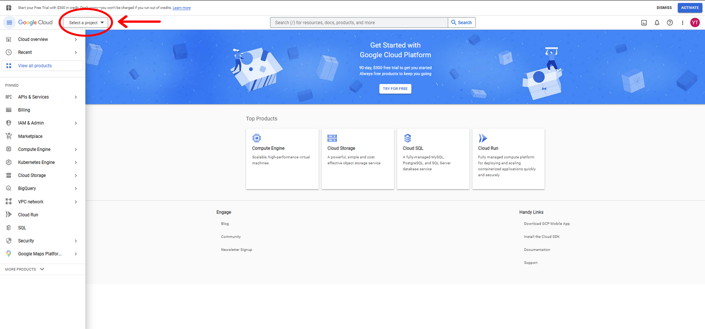
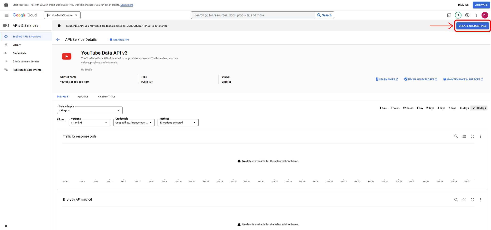
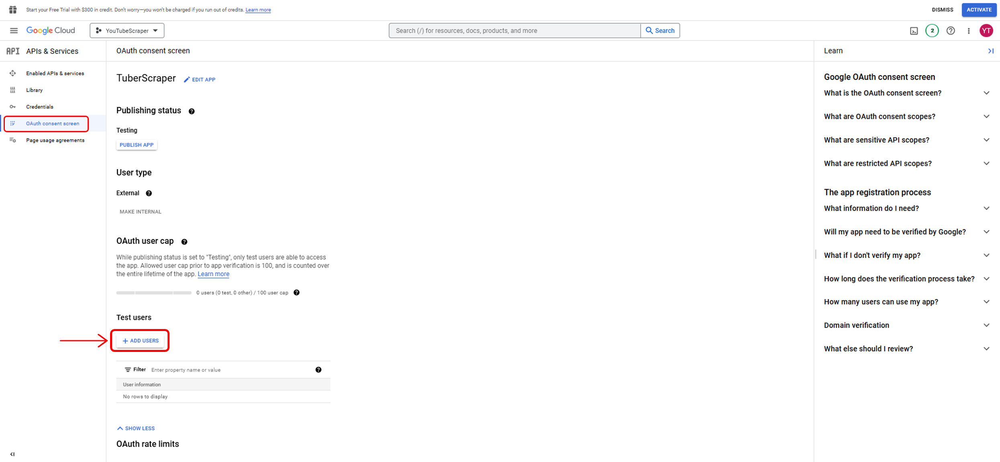
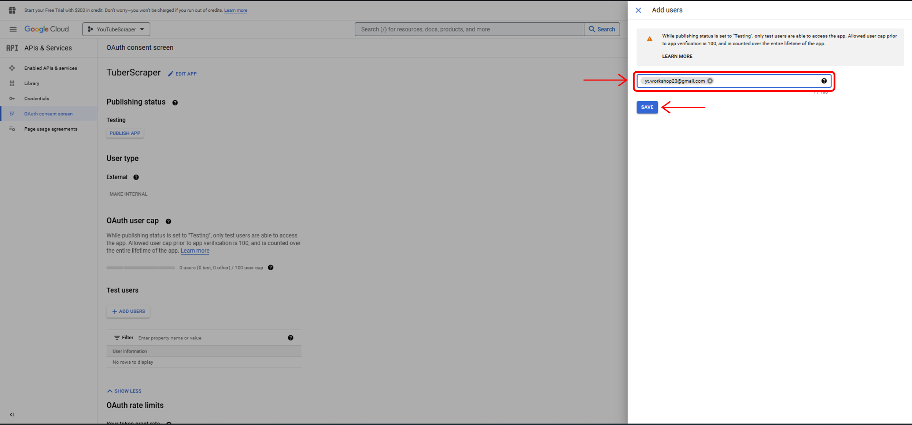

layout: true

```{r child = "./content/config/sessions_setup.Rmd"}
```

---


## Setting up API access to the *YouTube* API
 
To effectively work with *YouTube* data, we need access to its Application Programming Interface (API). As this process, unfortunately, can be a bit tedious, we prepared this preliminary tutorial so you don't have to spend time setting up your API access during the workshop. Please follow this tutorial and check if the setup works before the workshop. If your setup does not work, feel free to contact us before the workshop (the sooner the better) and we'll try to assist you in setting up access to the *YouTube* API. If, for some reason, setting up access to the API does not work for you and we don't find a solution or if you cannot access the API during the workshop, we will have some data prepared that you can then work with in the workshop.

Contact: [annika.deubel@cais-research.de](mailto:annika.deubel@cais-research.de)
  
[HINT](https://en.wikipedia.org/wiki/YouTube): Orange texts in the slides are hyperlinks that you can simply click on

---

## Setting up API Access
  
- For starters, you need a *Gmail* account
- We suggest that you create a new account specifically for this workshop

- You can create a new account [here](https://accounts.google.com/signup/v2/webcreateaccount?service=mail&continue=https%3A%2F%2Fmail.google.com%2Fmail%2F&ltmpl=googlemail&gmb=exp&biz=false&flowName=GlifWebSignIn&flowEntry=SignUp)

- Next, you need to:
  - Sign up for the *Google Developer Console*
  - Create a new project
  - Activate the Youtube Data API v3
  - Create authentication credentials
  - Test the credentials from R

We will explain these steps in detail on the following slides.

---
## Google Developer Console
  
Go to the [Developer Console](https://console.developers.google.com) and log in with your (new) *Google* account. You need to accept the *Google* Developer Terms of Service (ToS). You can deselect the email updates, and click "Agree and continue".


---

## Creating a Project

After that, you need to click on "Select a project" on the top left of the screen.



---

# Creating a Project

In the pop-up window, click on "New project" to create a new project.


---
## Creating a Project

Enter a project name and click on "create". You don't need to specify an organization.


---
## Activating the YouTube Data API v3

On the next screen, go to your project by clicking on "Select Project" in the pop-up window on the top right.


---
## Activating the YouTube Data API v3

On your project site, scroll down and click on "Explore and enable APIs".


---
## Activating the YouTube Data API v3

Next, click on the blue "Enable APIs and services" button on the top left side. 


---

## Activating the YouTube Data API v3

On the next page, search for "youtube data api v3".


---

## Activating the YouTube Data API v3

Select "YouTube Data API v3"


---

## Activating the YouTube Data API v3

On the next screen, click "enable" to activate the YouTube data API v3.


---

## Creating Credentials

In the next step, click on "Create Credentials" on the top right.


---

## Creating Credentials

On the next screen, select "YouTube Data API v3" and click on the "User Data" radio button, then click "next".


---

## Creating Credentials

Next, specify an arbitrary app name and enter your (new) *Gmail* address as the user support email and developer contact email. Click "Save and continue" afterwards.


---

## Creating Credentials

Click on "Add or removes scopes" next.


---

## Creating Credentials

Use the uppermost checkbox to select all scopes on all pages of the table. *Note*: For this workshop it's sufficient to only select the scopes for the YouTube Data API v3 (which you could do via the filter box), but it is quicker and easier, if you simply select everything. Afterwards, click on "update".


---

## Creating Credentials

Next, click on "Save and continue" to confirm your selection of scopes.


---

## Creating Credentials

Select "Desktop App" as the application type and specify the name of you set of credentials (can be any name). Click on "Create" to confirm.


---

## Creating Credentials

On the bottom of the page, click "Done" to finalize your changes.


---

## Creating Credentials

Navigate to the "OAuth Consent Screen" tab in the menu on the left and click on "Add Test Users".



---

## Creating Credentials

In the sidebar panel that should open on the right, enter your *Gmail* address as a test user and click "Save".


---

## Creating Credentials

Next, go back to the credentials page using the menu on the left.


---

## Creating Credentials

While we are here, we can also generate an API key that can be used for access to publicly available YouTube data using the API. Click on the blue "Create Credentials" button on the top and select "API key".


---

## Creating Credentials

We also need an OAuth client ID + secret. Click on the "Oauth 2.0 Client ID" name that you specified before.


---

## Creating Credentials

Congratulations! You now have your credentials! You can see your client ID and secret on the screen that should open now.


---

## Testing Your API Access

You can now safely try whether your *YouTube* API access works as intended by running the 
following commands in `R`. We suggest that you *NOT* save an access token when prompted by `R` (see instructions in code comments)

```{r eval = FALSE}
# installing the tuber package if not installed already
if("tuber" %in% installed.packages() != TRUE) {
  install.packages("tuber")
}

# loading tuber package
library(tuber)

# Your Credentials (NEVER SHARE THIS INFORMATION)
ID <- "ENTER-YOUR-CLIENT-ID-HERE"
secret <- "ENTER-YOUR-CLIENT-SECRET-HERE"

# authentication
yt_oauth(ID,secret)

# You will be asked in the R-console to
# save an access token: Select "NO" by entering 2
# You will be sent to your browser to log in

```
---
## Grant Yourself Access

In the browser window that opens from your `R` session, select your (new) *Gmail* account.


---

## Grant Yourself Access

Google warns you that the app has not been verified, but you can trust yourself and click on "Continue".


---

## Grant Yourself Access

Allow the app (and, hence, yourself) to make changes to the account (you have created).


---

## Grant Yourself Access

Confirm your choices once more by clicking "Allow". Your browser should now display the following message:
`Authentication complete. Please close this page and return to R`.


---

## API Test Call

To easily check if everything worked, let's try to collect some simple data for a video.

```{r eval = FALSE}

# get statistics of https://www.youtube.com/watch?v=HluANRwPyNo
get_stats(video_id="HluANRwPyNo")

```

---

## API Test Call Output

If everything worked correctly, the output should look like this.
*Note*: The actual numbers will vary because they might have changed in the meantime.

```{r eval = FALSE}
$id
[1] "HluANRwPyNo"

$viewCount
[1] "21275354"

$likeCount
[1] "1043372"

$favoriteCount
[1] "0"

$commentCount
[1] "37859"
```
---

## A Few Words of Advice on Handling Your *YouTube API Access*

- Have one account and project ready for the workshop for which you know that it works
- Do not use your API access too excessively before the workshop to avoid any risk of it being suspended
  
- Never share your OAuth login credentials or API key! This can easily happen by accident when:
  - saving code in a *GitHub* Repo
  - sending scripts to colleagues
  - troubleshooting someone else's code
  - for added security you can, e.g., use the [`keyring` package](https://cran.r-project.org/web/packages/keyring/keyring.pdf) (we'll say a bit more about this in the workshop)
 
---
class: center, middle

# We hope that you are now all set up and look forward to seeing you online!
