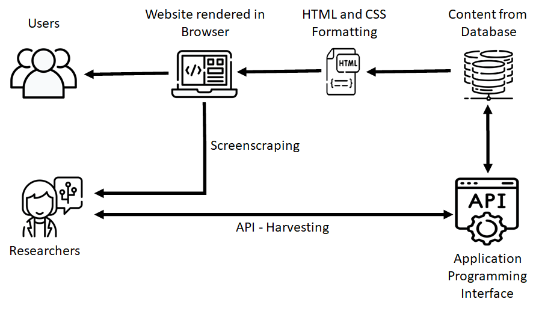
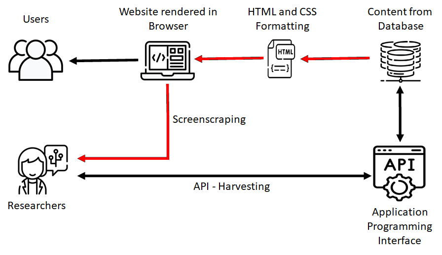
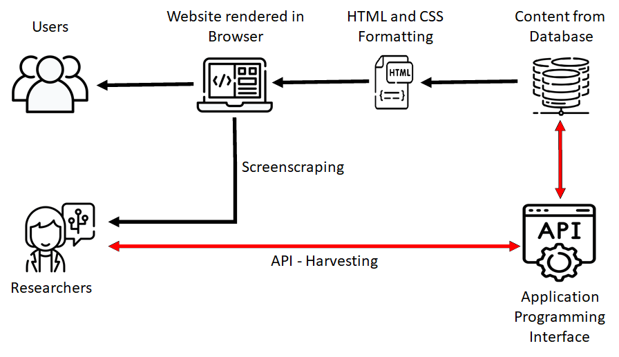

layout: true

```{r child = "./content/config/sessions_setup.Rmd"}
```

<!-- START HERE WITH SLIDES -->

---


## How Can We Get Data From Websites?

Theoretically, we could gather all the information manually by clicking on the things that are
 interesting to us and copy/pasting them. However, this is tedious and time-consuming. **We want a way of automatizing this task**. The solution to our problem is...

[Web scraping](https://en.wikipedia.org/wiki/Web_scraping). There are two different approaches:

1. **Screen scraping:** Getting the HTML-code out of your browser, parsing & formatting it, then analyzing the data
  
2. **API harvesting:** Sending requests directly to the database and only getting back the information that you want and need

---

## The Structure of Data on *YouTube*

- All data on *YouTube* is stored in a [MySQL](https://en.wikipedia.org/wiki/MySQL) database
 
- The website itself is an HTML page, which loads content from this database

- The HTML is rendered by a web browser so the user can interact with it

- Through interacting with the rendered website, we can either retrieve content from the database
or send information to the database

- The YouTube website is
  - built in [HTML](https://de.wikipedia.org/wiki/Hypertext_Markup_Language)<br>
  - uses [CSS](https://de.wikipedia.org/wiki/Cascading_Style_Sheets) for the "styling"<br>
  - dynamically loads content using [Ajax](https://en.wikipedia.org/wiki/Ajax) from the database

---
## Interaction with the Data

  
```{r, echo=F, out.width = "75%"}
include_graphics("./content/img/youtube_schematic.jpg")
```
---

## Screen Scraping

- Screen scraping means that we download the HTML text file, which contains the content we are interested in but also a lot of unnecessary clutter that describes how the website should be rendered by the browser

  
```{r, echo=F, out.width = "75%"}
include_graphics("./content/img/youtube_scraping.png")
```

---

## Screen Scraping

- To automatically obtain data, we can use a so-called [GET request](https://en.wikipedia.org/wiki/Hypertext_Transfer_Protocol)

- A GET request is an HTTP method for asking a server to send a specific resource (usually an HTML page) back
to your local machine. It is implemented in many different libraries, such as [curl](https://cran.r-project.org/web/packages/curl/vignettes/intro.html).

- This is the basic principle that all the scraping packages are built on

- We will not use this directly and will let the higher-level applications handle this under the hood
---

## Screen Scraping - Examples

- Via the console in Linux or MacOS (saves html to a file) <br>
<br>
`curl "https://www.youtube.com/watch?v=1aheRpmurAo/" > YT.html`
<br>
<br>

- [Online](https://reqbin.com/curl), using the code from above <br>
<br>
`curl "https://www.youtube.com/watch?v=1aheRpmurAo/"`
<br>
<br>
- In `R` <br>
<br>
```
# Warning about incomplete final line can (usually) be ignored
library(curl)
html_text <-
readLines(curl("https://www.youtube.com/watch?v=1aheRpmurAo/"))
```
<br>
<br>

---
## Screen Scraping: Advantages

  + You can access everything that you are able to access from your browser
  + You are (theoretically) not restricted in how much data you can get
  + (Theoretically) Independent from API-restrictions
  
---

## Screen Scraping: Disadvantages

  - Extremely tedious to get information out of HTML-pages
  - You have to manually look up the Xpaths/CSS/HTML containers to get specific information
  - Reproducibility: The website might be tailored to stuff in your cache, cookies, accounts etc.
  - There is no guarantee that even pages that look the same have the same underlying HTML structure
  - You have to manually check the website and your data to make sure that you get what you want
  - If the website changes anything in their styling, your scripts probably won't work anymore
  - [Legality](https://en.wikipedia.org/wiki/Web_scraping#Legal_issues) depends on country

---

## API Harvesting

- An [**A**pplication **P**rogramming **I**nterface](https://en.wikipedia.org/wiki/Application_programming_interface)...
  - is a system built for developers
  - directly communicates with the underlying database(s)
  - is a voluntary service provided by the platform
  - controls what information is accessible, to whom, how, and in which quantities
  
  

```{r api-figure, out.width = "80%", echo=FALSE}
#include_graphics("./Images/YouTube_schematic2_harvesting.png")
```

---

## Using APIs

- APIs can be used to/for:

  - embed content in other applications
  - create bots that do something automatically
  - scheduling/moderation for content creators
  - collect data for (market) research purposes

- Not every website has their own API. However, most large social media services do, e.g.:
  - [Facebook](https://developers.facebook.com/docs/graph-api?locale=de_DE)
  - [Twitter](https://developer.twitter.com/en/docs/basics/getting-started)
  - [Instagram](https://www.instagram.com/developer/)
  - [Wikipedia](https://en.wikipedia.org/w/api.php)
  - [Google Maps](https://www.programmableweb.com/api/google-maps-places)
  
  
---
## API Harvesting - Examples

- From the console <br> (API Key needs to be added before execution) <br>
```
curl "https://www.googleapis.com
        /youtube/v3/search?
        part=snippet&q=Brexit&
        key=INSERT-API-KEY-HERE"
```

- [Online](https://reqbin.com/curl), using code from above (API Key needs to be added before execution) <br>
<br>

- In `R` (API Key needs to be added before execution, data needs to be converted to JSON format) <br>
```
library(curl)
library(jsonlite)
api_response <- fromJSON(curl("https://www.googleapis.com/
                                youtube/v3/search?
                                part=snippet&q=Brexit&
                                key=INSERT-API-KEY-HERE"))
```

---

## Advantages of API Harvesting

  + No need to interact with HTML files, you only get the information you asked for
  + The data you get is already nicely formatted (usually [JSON](https://en.wikipedia.org/wiki/JSON) files)
  + You can be confident that what you do is legal (if you adhere to the Terms of Service and respect data privacy and copyright regulations)
  
---

## Disadvantages of API Harvesting

  - Not every website/service has an API
  - You can only get what the API allows you to get
  - There are often restricting quotas (e.g., daily limits)
  - Terms of Service can restrict how you may use the data (e.g., with regard to sharing or publishing it)
  - There is no standard language to make queries, you have to check the documentation
  - Not every API has a (good) documentation
  
---
class: inverse, middle, center
# Screen Scraping vs. API-Harvesting

If you can, use an API, if you must, use screen scraping instead.

---

## Platform APIs

- To find an API for a given website, [Programmable Web](https://www.programmableweb.com/category/all/apis) is
  a good starting point

- Fortunately, *YouTube* has its own, well-documented APIs
  that developers can use to interact with their database (most *Google* services do)

- We will use the [YouTube Data API](https://developers.google.com/youtube/v3/docs) in this workshop

---

## Let's Check Out the *YouTube* API!

- Google provides a sandbox for their API that we can use to get a grasp of how it operates

- We can, for example, use our credentials to search for videos with the keyword "Brexit"

- [Example](https://developers.google.com/youtube/v3/docs/search/list?apix_params=%7B%22part%22%3A%22snippet%22%2C%22q%22%3A%22Brexit%22%7D)

- Keep in mind: We have to log in with the *Google* account we used to create the app for accessing the API

- What we get back is a JSON-formatted response with the information we requested in the API sandbox

---

## Excursus: What is `JSON`?

- [Java Script Object Notation](https://en.wikipedia.org/wiki/JSON)

- Language-independent data format (like .csv)

- Like a nested List of Key:Value pairs

- Standard data format for many APIs and web applications

- Better than tabular formats (.csv / .tsv) for storing large quantities of data by not declaring missing data

- Represented in `R` as a list of lists that typically needs to be transformed into a regular dataframe (this can be tedious but, luckily, there are packages and functions for handling this, such as [`jsonlite`](https://github.com/jeroen/jsonlite))

---

## Excursus: What is `JSON`?

```{r, results = 'hide'}
'{
  "first name": "John",
  "last name": "Smith",
  "age": 25,
  "address": {
    "street address": "21 2nd Street",
    "city": "New York",
    "postal code": "10021"
  },
  "phone numbers": [
    {
      "type": "home",
      "number": "212 555-1234"
    },
    {
      "type": "mobile",
      "number": "646 555-4567"
    }
  ],
  "sex": "male"
}'
```
---

## API Key vs. OAuth2.0

- There are two different ways to authenticate with the YouTube API

  - API Key: Text string identifying the app and user, grants access to public data
  
  - OAuth2.0: Token created from Client secret and Client ID, grants access to everything the user can access
  
- For most API calls, the API key is enough

- the `tuber` package for `R`, however, uses OAuth2.0 authentification because you can also use it to, e.g., change your account information from `R`

---

## Constructing API calls

 We can construct all calls to the API according to the following logic


---

## Important *YouTube* API Parameters

- All possible resources for the *YouTube* API are listed [here](https://developers.google.com/youtube/v3/docs/)

- For our workshop, the most important resources will be `search`, `Comments`, `CommentThreads`, and `videos`

- **NB**: Some information is only visible to owners of a channel or author of a video

- Not all information is necessarily available for all videos (e.g., live videos)

- Public data requires an API key, getting user data requires OAuth2.0 authentication

---

## Using the API from `R`

- We can simplify the process of interacting with the YouTube API by using a dedicated `R` package

- The package handles the authentication with our credentials and translates `R` commands into API calls

- It also simplifies the JSON response to a standard dataframe automatically for many requests

- In essence, we can run `R` commands and get nicely formatted API results back

- For this workshop, we will mostly use the [tuber package](https://cran.r-project.org/web/packages/tuber/tuber.pdf), and also briefly explore the [vosonSML package](https://cran.r-project.org/web/packages/vosonSML/index.html)

---

## API Rate Limits

- With the API, you have a limit of how much data you can get

- The daily quota limit has constantly decreased significantly over the last decade

.center[]

---

## API Rate Limits

- Currently (02.2022), you have a quota of **10.000** units per day

- Each request (even invalid ones) costs a certain amount of units

- There are two factors influencing the quota cost of each request:

  - different types of requests (e.g., write operation: 50 units; video upload: 1600 units)
  
  - how many parts the requested resource has (playlist:2 ; channel:6 ; video:10)
  
- **You should only request parts that you absolutely need to make the most of your units. We will talk about this in more detail in the data collection session. ** 

**NB: Sending incorrect requests can also deplete your daily quota**

---

## API Rate Limits

- You can check the rate limits in the [_YouTube_ API Documentation](https://developers.google.com/youtube/v3/getting-started#quota)

- You can see how much of your quota you have already used up in the [*Google* Developer Console](https://console.developers.google.com/iam-admin/quotas?authuser=3&project=)


#

---

## Exceeding the API Rate Limit

Once you reach your rate limit, the API will start to send back the following response until your rate limit is reset
.mini[
```
{
  "error": {
    "code": 403,
    "message": "The request cannot be completed because you
    have exceeded your \u003ca href=\"/youtube/v3/getting-started#quota\"
    \u003equota\u003c/a\u003e.",
    "errors": [
      {
        "message": "The request cannot be completed because
        you have exceeded your \u003ca href=\"/youtube/v3/
        getting-started#quota\
        "\u003equota\u003c/a\u003e.",
        "domain": "youtube.quota",
        "reason": "quotaExceeded"
      }
    ]
  }
}

```
]
---

## Can I Increase my Rate Limit? A "Short" Story

  

---

## Trying to Raise the *YouTube* API Quota

- Study that needed large datasets in a short amount of time

- RQ: Is there a u-shaped relationship between success and number of uploads?

- Sample: 600 popular channels (identified via SocialBlade) 

- Request for higher quota (October 11, 2019)

- Problem: Same application form for (web) apps and research

- Hard to figure what applies to research and what to write into the form

- Experience: Stuck in an infinite loop with e-mails from *Google* support on this issue
  
---

class: center, middle

# Any questions?

---

class: center, middle

# [Exercise](https://jobreu.github.io/youtube-workshop-gesis-2022/exercises/A2_The_Youtube_API_exercises_question.html) time `r ji("weight_lifting_woman")``r ji("muscle")``r ji("running_man")``r ji("biking_man")`

## [Solutions](https://jobreu.github.io/youtube-workshop-gesis-2022/solutions/A2_The_Youtube_API_exercises_solution.html)
