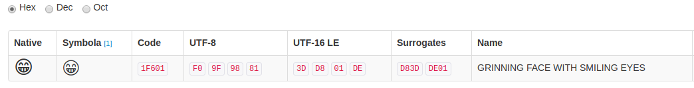

layout: true

```{r child = "./content/config/sessions_setup.Rmd"}
```

<!-- START HERE WITH SLIDES -->

---

## Setup

*Note*: In previous versions of `R`, all strings were automatically translated to factors when reading data. This has been [changed with version 4.0.0](https://developer.r-project.org/Blog/public/2020/02/16/stringsasfactors/).

```{r}
# Only necessary for R versions < 4.0.0
options(stringsAsFactors = FALSE)

# Load the data set
comments <- readRDS("./content/data/ParsedEmojiComments.rds")
```

---

## Sentiment Analysis

- The basic task of sentiment analysis is to detect the positive and negative __valence__ of a sentence or a collection of sentences

- Sentiment is often used in market research for product reviews

--

- For *YouTube* videos, we can look at the sentiment in the comments to quantify the valence of user reactions

- *Note*: There are also other methods for detecting:
  - emotional states
  - political stances
  - objectivity/subjectivity

---

## Basic Idea of Sentiment Analysis

We compare each word in a sentence with a predefined dictionary

- Each word gets a score: For example a score between -1 (negative) and +1 (positive), with 0 being neutral

- We add up all the scores for a sentence to get an overall score for the sentence


.center[]

---

## Basic Sentiment Analysis

- Example from lexicon. Jockers is an example table with 10738 rows.

```{r}
lexicon::hash_sentiment_jockers[sample(1:10738,10),]
```

---
## Basic Sentiment Analysis

- This simple approach is usually only a crude approximation

- It is limited for a multitude of reasons:
  - Negations ("This video is not bad, why would someone hate it?")
  - Adverbial modification ("I love it" vs. "I absolutely love it")
  - Context ("The horror movie was scary with many unsettling plot twists")
  - Domain specificity ("You should see their decadent dessert menu")
  - Slang ("Yeah, this is the shit!")
  - Sarcasm ("Superb reasoning, you must be really smart")
  - Abbreviations ("You sound like a real mofo")
  - Emoticons and emoji ("How nice of you... `r emo::ji("angry")`")
  - ASCII Art ("( ͡° ͜ʖ ͡°)")

---
## Basic Sentiment Analysis

- These limitations can lead to inaccurate classifications, for example...

- Classified as negative (unpopular, hate)
```{r}
comments$TextEmojiDeleted[7088]
```

- Classified as positive (genuinely, enjoy)
```{r}
comments$TextEmojiDeleted[935]
```

---

## Sentiment Analysis of _YouTube_ Comments

There are more sophisticated methods for sentiment analysis that yield  better results. However, their complexity is beyond the scope of this workshop. We will do three things in this session and compare the respective results

1. Apply a basic sentiment analysis to our scraped _YouTube_ comments

2. Use a slightly more elaborate out-of-the-box method for sentiment analysis

3. Extend the basic sentiment analysis to emoji

---

## Sentiment Analysis of _YouTube_ Comments

**Word of Advice:** Before using the more elaborate methods in your own research, make sure that you understand the underlying model, so you can make sense of your results. You should never blindly trust someone else's implementation without understanding it. Also: Always do sanity checks to see if you get any unexpected results.

---

## Basic Comment Sentiments

First of all, we load the [`syuzhet` package](https://github.com/mjockers/syuzhet) and try out the built-in basic sentiment tagger with an example sentence

```{r}
# load data
comments <- readRDS("./content/data/ParsedEmojiComments.rds")

# load package
library(syuzhet)

# test simple tagger
get_sentiment("Superb reasoning, you must be really smart!")
```

---

## Basic Comment Sentiments

We can apply the basic sentiment tagger to the whole vector of comments in our data set. Remember that we need to use the text column without hyperlinks and emojis.

```{r}
# create basic sentiment scores
BasicSentiment <- get_sentiment(comments$TextEmojiDeleted)

# summarize basic sentiment scores
summary(BasicSentiment)
```

Checking the documentation for the `get_sentiment()` function reveals that it can take different _methods_ as arguments. These methods correspond to different dictionaries and might yield different results. The function also allows using a custom dictionary by providing a dataframe to the _lexicon_ argument.

---

## Basic Comment Sentiments

Let's compare the results of the different dictionaries (getting the sentiments for NRC can take a while)

```{r, message = FALSE, warning = FALSE, cache = TRUE}
# compute sentiment scores with different dictionaries
BasicSentimentSyu <- get_sentiment(comments$TextEmojiDeleted,
                                   method = "syuzhet")
BasicSentimentBing <- get_sentiment(comments$TextEmojiDeleted,
                                    method = "bing")
BasicSentimentAfinn <- get_sentiment(comments$TextEmojiDeleted,
                                     method = "afinn")
BasicSentimentNRC <- get_sentiment(comments$TextEmojiDeleted,
                                   method = "nrc")
```
---

## Basic Comment Sentiments

```{r}
# combine them into a dataframe
Sentiments <- cbind.data.frame(BasicSentimentSyu,
                               BasicSentimentBing,
                               BasicSentimentAfinn,
                               BasicSentimentNRC,
                               1:dim(comments)[1])
# set column names
colnames(Sentiments) <- c("Syuzhet",
                          "Bing",
                          "Afinn",
                          "NRC",
                          "Comment")
```
---

## Basic Comment Sentiments

.small.remark-code[
```{r, out.width="50%"}
# correlation matrix
library(ggcorrplot)
ggcorrplot(cor(Sentiments[,c(-5)]),
           color=c("red","white","blue"),
           title="Correlations between Sentiment dictionaries",
           lab=TRUE)
```
]

---

### Basic Comment Sentiments: Jitter Plot

```{r, echo = FALSE, cache = TRUE}
# transform data into long format
library(tidyr)
SentimentsLong <- pivot_longer(Sentiments, !Comment, names_to = "Dictionary", values_to = "Value")

# point jitter plot
ggplot(SentimentsLong, aes(x=Dictionary,
                            y=Value)) + 
  geom_jitter(position=position_jitter(0.2),size=0.5) +
  ggtitle("Distributions of Sentiment Scores for different Dictionaries")

```

---

### Basic Comment Sentiments: Ridgeline Plot

```{r, echo = FALSE, cache = TRUE}
# ridgeline plot
library(ridgeline)
ridgeline(SentimentsLong$Value,SentimentsLong$Dictionary)
```

---

### Basic Comment Sentiments: Scatter Plot

```{r, echo = FALSE, cache = TRUE}
# scatter lplot
ggplot(SentimentsLong, aes(x=Comment, y=Value, col=Dictionary)) + 
    geom_point(size =0.5) +
    ggtitle("Sentiment Scores for Different Dictionaries")
```

---

## Basic Comment Sentiments

The choice of the dictionary can have an impact on your sentiment analysis. For this reason, it's crucial to select the dictionary with care and to be aware of how, by whom and for which purpose it was constructed. You can find more information on the specifics of the differnt dictionaries [here](https://arxiv.org/pdf/1901.08319.pdf).

It can also make sense to use more than one dictionary to check the robustness of the analysis

In this session, we will continue with the `syuzhet` dictionary

```{r, results = 'hide'}
# add the syuzhet sentiment scores to our dataframe
comments$Sentiment <- Sentiments$Syuzhet
```

---

## Basic Comment Sentiments

Another pitfall to be aware of is the length of the comments. Let's have a look at the distribution of words per comment.

```{r, warning = FALSE, cache = TRUE}
# compute number of words per comment
comments$Words <- sapply(comments$TextEmojiDeleted,
                         function(x){length(unlist(strsplit(x,
                                                            " ")))})
```


```{r, results = 'hide', fig.show = 'hide', out.width = "80%", warning = FALSE, cache = TRUE}
# histogram
ggplot(comments, aes(x=Words)) + 
  geom_histogram(binwidth = 5) + 
  geom_vline(aes(xintercept=mean(Words)),
             color="red",
             linetype="dashed",
             size = 0.5) +
  ggtitle(label = "Number of Words per Comment") +
  xlab("No. of Words") +
  ylab("No. of Comments")+
  xlim(0, 100)

```

---

### Basic Comment Sentiments

```{r, echo = FALSE, warning = FALSE, cache = TRUE}
# histogram
ggplot(comments, aes(x=Words)) + 
  geom_histogram(binwidth = 5) + 
  geom_vline(aes(xintercept=mean(Words)),
             color="red",
             linetype="dashed",
             size = 0.5) +
  ggtitle(label = "Number of Words per Comment") +
  xlab("No. of Words") +
  ylab("No. of Comments")+
  xlim(0, 100)

```

---

## Basic Comment Sentiments

Because longer comments also contain more words, they have a higher likelihood of getting more extreme sentiment scores. Lets' look at one of the most negatively scored and one of the most positively scored comments.

```{r, results = 'hide'}
# Very positively scored comment
comments$TextEmojiDeleted[7135]

# Very negatively scored comment
comments$TextEmojiDeleted[29916]

```

---

## Basic Comment Sentiments

**Positively scored comment:**
"The emoji movie is a beautifully executed, well layered experience that has been the victim of a barrage of such biased reviews such as “The worst movie of 2017”
, “ a very formulaic story” and “9% on Rotten Tomatoes.” So, in defense of this movie, i will give you, the reader, why The Emoji Movie is in fact the best movie 
of in 2017. Remember, though, that this essay has some of my opinions, and takes on certain parts of the film. The Story. The story is a beautifully written, homage
to many fairy tales. If you have not watched this movie yet, here's the rundown of the story. Gene is a meh emoji in a world of other emoji’s on a teenager’s smartphone.
Gene, not wanting to be like the other emoji’s, goes out to find himself. Along the way, [...]"

---

## Basic Comment Sentiments

**Negatively scored comment:**
"How far we've fallen from the light of Yeshua? Only for our arrogance were we to be consumed by the Leviathon and trapped within the belly
of the beast as it slowly bleeds out as our wicked and unwashed cries of agony fall on deaf ears, cursed to toil within and gaze back on our decaying with envious eyes
as death hadn't taken us first. Heh, I dunno... Emojis are pretty much a line of communication for minorities drug deals/hookups. [...]"

---

### Basic Comment Sentiments

```{r, echo = FALSE, cache = TRUE}
# plot sentiment vs. number of words
ggplot(comments, aes(x = Words, y = Sentiment, col = Sentiment)) + 
    geom_point(size = 0.5) +
    ggtitle("Sentiment Scores vs. Comment length") +
    xlab("No. of Words in Comment") +
    ylab("Sentiment Score of Comment") +
    scale_color_gradient(low = "red", high = "green")

```

---

## Basic Comment Sentiments

To control for the effect of comment length, we can divide the sentiment score by the number of words in the comment to get a new indicator:  _SentimentPerWord_ 

```{r, results = 'hide'}
# normalize for number of words
comments$SentimentPerWord <- comments$Sentiment / comments$Words

# most positive comment
head(comments$TextEmojiDeleted[comments$Sentiment ==
                                 max(comments$SentimentPerWord,
                                     na.rm = T)],1)
```
When i was like 8 or 7 i liked this movie
```{r, results = 'hide'}
# most negative comment
head(comments$TextEmojiDeleted[comments$Sentiment ==
                                 min(comments$SentimentPerWord,
                                      na.rm = T)],1)
```
2017 was fucking wild

---

### Basic Comment Sentiments

```{r, fig.show = 'hide', cache = TRUE}
# plot SentimentPerWord vs. Number of Words
ggplot(comments, aes(x = Words, y = SentimentPerWord, col = Sentiment)) + 
    geom_point(size = 0.5) +
    ggtitle("Sentiment per Word Scores vs. Comment length") +
    xlab("No. of Words in Comment") +
    ylab("Sentiment Score per Word") +
    scale_color_gradient(low = "red", high = "green")
```

---

### Basic Comment Sentiments

```{r, echo = FALSE, out.width = "70%", warning = FALSE, message = FALSE, cache = TRUE}
# plot SentimentPerWord vs. Number of Words
ggplot(comments, aes(x = Words, y = SentimentPerWord, col = Sentiment)) + 
    geom_point(size = 0.5) +
    ggtitle("Sentiment per Word Scores vs. Comment length") +
    xlab("No. of Words in Comment") +
    ylab("Sentiment Score per Word") +
    scale_color_gradient(low = "red", high = "green")
```

---

## More Elaborate Method(s)

Although no sentiment detection method is perfect, some are more sophisticated than others. Two of those options are

  - the [`sentimentR` package](https://github.com/trinker/sentimentr)
  - the [*Stanford coreNLP*](https://stanfordnlp.github.io/CoreNLP/) utilities set


`SentimentR` attempts to take **valence shifters** into account:
- negators ("not")
- amplifiers / intensifiers ("very"),
- de-amplifiers / downtoners ("hardly", "somewhat"),
- adversative conjunctions ("but", "however")

---

## More Elaborate Method(s)

Negators appear ~20% of the time a polarized word appears in a sentence. Conversely, adversative conjunctions appear with polarized words ~10% of the time. Hence, not accounting for **valence shifters** could significantly impact the modeling of the text sentiment.

---

## More Elaborate Method(s)

**Stanford coreNLP** utilities set:
- build in Java
- very performant
- good [documentation](https://stanfordnlp.github.io/CoreNLP/)
- but tricky to get to work in `R`


We will be using `sentimentR` for this session as it represents a good trade-off between usability, speed, and performance

---

## `SentimentR`

First, we need to install and load the package

```{r, warning = FALSE, message = FALSE}
if ("sentimentr" %in% installed.packages() == FALSE) {
  install.packages("sentimentr")
}

library(sentimentr)
```
Then we can compute sentiment scores

```{r, cache = TRUE}
# compute sentiment scores
Sentences <- get_sentences(comments$TextEmojiDeleted)
SentDF <- sentiment_by(Sentences)
comments <- cbind.data.frame(comments,SentDF[,c(2,3,4)])
colnames(comments)[c(15,16,17)] <- c("word_count",
                                     "sd",
                                     "ave_sentiment")
```

---

## `SentimentR`

Let's check if the sentiment scoring for sentimentR correlates with the simpler approach

```{r, warning = FALSE, message = FALSE, results ='hide', fig.show='hide', cache = TRUE}
# plot SentimentPerWord vs. SentimentR
ggplot(comments, aes(x=ave_sentiment, y=SentimentPerWord)) + 
    geom_point(size =0.5) +
    ggtitle("Basic Sentiment Scores vs. `SentimentR`") +
    xlab("SentimentR Score") +
    ylab("Syuzhet Score") +
    geom_smooth(method=lm, se = TRUE)
```
---

### `SentimentR`

```{r, echo = FALSE, warning = FALSE, message = FALSE, cache = TRUE}
# plot SentimentPerWord vs. SentimentR
ggplot(comments, aes(x=ave_sentiment, y=SentimentPerWord)) + 
    geom_point(size =0.5) +
    ggtitle("Basic Sentiment Scores vs. `SentimentR`") +
    xlab("SentimentR Score") +
    ylab("Syuzhet Score") +
    geom_smooth(method=lm, se = TRUE)
```

---

## `SentimentR`

We can also look at the difference scores for the two methods

```{r, warning = FALSE, message = FALSE, results = 'hide', fig.show='hide', cache = TRUE}
#compute difference score
comments$SentiDiff <- comments$ave_sentiment-
                      comments$SentimentPerWord

ggplot(comments, aes(x=SentiDiff)) + 
  geom_histogram(color="black", fill="white")+
  labs(title="Sentiment Score Difference Distribution",
       x="Difference Score",
       y = "Frequency")

```

---

### `SentimentR`

```{r, echo = FALSE, warning = FALSE, message = FALSE, cache = TRUE}
# difference score
ggplot(comments, aes(x=SentiDiff)) + 
  geom_histogram(color="black", fill="white")+
  labs(title="Sentiment Score Difference Distribution",
       x="Difference Score",
       y = "Frequency")
```


---

## `SentimentR`

Let's check for which comments we get large differences between the two methods.
*Note*: We use an absolute difference score here and order from largest to smallest difference.

```{r, cache = TRUE}
# illustrate scoring differences
Diff_comments <- comments[order(-abs(comments$SentiDiff)),
                          ][c(2,12:18)]
Diff_comments[c(1,2,3,4), c(8, Syuzhet = 2, SentimentR = 7, 1)]
```

---

## `SentimentR`

Compared to the basic approach, `sentimentR` is:
  - better at dealing with negations
  - better at detecting fixed expressions
  - better at detecting adverbs
  - better at detecting slang and abbreviations
  - relatively easy to implement
  - quite fast

---

## Sentiments for Emojis

Emojis are often used to confer emotions (hence the name), so they might be a valuable addition to assess the sentiment of a comment. This is less straight-forward than assessing sentiments based on word dictionaries for multiple reasons:

- Emojis can have multiple meanings: `r emo::ji("pray")`
- They are highly context-dependent: `r emo::ji("eggplant")`
- They are culture-dependent: `r emo::ji("peach")`
- They are person-dependent: `r emo::ji("laugh")` `r emo::ji("tears")`


---

### Sentiments for Emojis

In addition, emojis are rendered differently on different platforms, meaning that they can potentially elicit different emotions


Source: [Miller et al., 2016](https://jacob.thebault-spieker.com/papers/ICWSM16_emoji.pdf)

---

## Sentiments for Emojis

Emojis are also notoriously difficult to deal with from a technical perspective due to the infamous [character encoding hell](https://dss.iq.harvard.edu/blog/escaping-character-encoding-hell-r-windows)

- Emojis can come in one of multiple completely different encodings
- Your operating system has a default encoding that is used when opening/writing files in a text editor
- Your `R` installation has a default encoding that gets used when opening/writing files

---

## Sentiments for Emojis

If either of those mismatch at any point, you can  accidentally overwrite the original encoding in a non-recoverable way. For us, this happened quite often with UTF-8 encoded files on Windows (the default encoding there is Latin-1252).



---

## Sentiments for Emojis

Luckily, we already saved our emojis in a textual description format and can simply treat them as a character strings for our sentiment analysis. We can therefore proceed in 3 steps:

1. Create a suitable sentiment dictionary for textual descriptions of emojis

2. Compute sentiment scores for comments only based on emojis

3. Compare the emojis sentiment scores with the text-based sentiments

---

## Emoji Sentiment Dictionary

We will use the emoji sentiment dictionary from the `lexicon` package. It only contains the 734 most frequent emojis, but since the distribution of emojis follows [Zipf's Law](https://en.wikipedia.org/wiki/Zipf%27s_law), it should cover most of the used emojis.

```{r, cache = TRUE}
# emoji sentiments
EmojiSentiments <- lexicon::emojis_sentiment
EmojiSentiments[1:5,c(1,2,4)]
```

---

## Emoji Sentiment Dictionary

By comparison, our data looks like this:
  
```{r}
# example from our data 
comments$TextEmojiReplaced[5999]
```

---

## Emoji Sentiment Dictionary

We bring the textual description in the dictionary in line with the formatting in our data so we can replace one with the other using standard text manipulation techniques

```{r}
# change formatting in the emoji dictionary
EmojiNames <- paste0("emoji_",gsub(" ","",EmojiSentiments$name))
EmojiSentiment <- cbind.data.frame(EmojiNames,
                                   EmojiSentiments$sentiment,
                                   EmojiSentiments$polarity)
names(EmojiSentiment) <- c("word","sentiment","valence")
EmojiSentiment[1:5,]
```
---

## Emoji Sentiment Dictionary

```{r, cache = TRUE}
# tokenize the emoji-only column in our formatted dataframe
library(quanteda)
EmojiToks <- tokens(tolower(as.character(unlist(comments$Emoji))))
comments$Text[11557]
EmojiToks[11557]
```

---

## Computing Sentiment Scores

We can now replace the emojis that appear in the dictionary with the corresponding sentiment scores

```{r, cache = TRUE}
# create the dictionary object
EmojiSentDict <- as.dictionary(EmojiSentiment[,1:2])

# replace emoji with sentiment scores
EmojiToksSent <- tokens_lookup(x = EmojiToks,
                               dictionary = EmojiSentDict)
comments$Text[11557]
EmojiToksSent[11557]
```


---

## Computing Sentiment Scores

.small.remark-code[
```{r, cache = TRUE}
# only keep the assigned sentiment scores for the emoji vector
AllEmojiSentiments <- tokens_select(EmojiToksSent,EmojiSentiment$sentiment,
                                    "keep")
AllEmojiSentiments <- as.list(AllEmojiSentiments)

# define function to average emoji sentiment scores  per comment
MeanEmojiSentiments <- function(x){
  
  x <- mean(as.numeric(as.character(x)))
  return(x)
  
}

# apply the function to every comment that contains emojis
MeanEmojiSentiment <- lapply(AllEmojiSentiments,MeanEmojiSentiments)
MeanEmojiSentiment[MeanEmojiSentiment == 0] <- NA
MeanEmojiSentiment <- unlist(MeanEmojiSentiment)
MeanEmojiSentiment[11557]
```
]
  
---

### Emoji Sentiment Scores

```{r, echo = FALSE, warning = FALSE, message = FALSE}
# plot histogram to check distribution of emoji sentiment scores
AES_df <- data.frame(MeanEmojiSentiment)
ggplot(AES_df, aes(x = AES_df[,1])) +
  geom_histogram(binwidth = 0.25) +
  labs(title = "Distribution of Average Emoji Sentiment Scores by Comment") +
  xlab("Emoji Sentiment Averaged per Comment")
```

---

## Emoji Sentiment vs. Word Sentiment

```{r}
comments <- cbind.data.frame(comments,MeanEmojiSentiment)

# correlation between average emoji sentiment score
#   and average text sentiment score
cor(comments$ave_sentiment,
    comments$MeanEmojiSentiment,
    use="complete.obs")
```


```{r, results = 'hide', warning = FALSE, message = FALSE, fig.show='hide', cache = TRUE}
# plot the relationship
ggplot(comments, aes(x = ave_sentiment,
                     y = MeanEmojiSentiment))+
  geom_point(shape = 1) +
  labs(title = "Averaged Sentiment Scores for Text and Emojis") +
  scale_x_continuous(limits = c(-5,5)) +
  scale_y_continuous(limits = c(-1,1))
```

---

### Emoji Sentiment vs. Word Sentiment

```{r, echo = FALSE, warning = FALSE, message = FALSE, cache = TRUE}
# plot the relationship
ggplot(comments, aes(x = ave_sentiment,
                     y = MeanEmojiSentiment))+
  geom_point(shape = 1) +
  labs(title = "Averaged Sentiment Scores for Text and Emojis") +
  scale_x_continuous(limits = c(-5,5)) +
  scale_y_continuous(limits = c(-1,1))
```
---

## Emoji Sentiment vs. Word Sentiment

As we can see, there seems to be no  meaningful relationship between the sentiment scores of the text and the sentiment
of the used emojis. This can have multiple reasons:
  - Comments that score very high (positive) on emoji sentiment typically contain very little text
  - Comments that score very low  (negative) on emoji sentiment typically contain very little text
  - Dictionary-based bag-of-words/-emojis sentiment analysis is not perfect - there is a lot of room for error in both metrics
  - Most comment texts are scored as neutral
  - Emojis are very much context-dependent, but we only consider a single sentiment score for each emoji
  - We only have sentiment scores for the most common emoji
  - If comments contain an emoji, it's usually exactly one emoji

---

## Takeaway

From the examples in this data, we have seen multiple things:

 - Sentiment detection is not perfect 
 - Bag-of-words approaches are often too simplistic
 - Even more sophisticated methods can often misclassify comments
 - The choice of dictionary and sentiment detection method is highly important and can change the results substantially
 - Emojis seem to be even more challenging for classifying sentiments

---
class: center, middle

# [Exercise](https://jobreu.github.io/youtube-workshop-gesis-2023/exercises/Exercise_B2_Sentiment_analysis_of_user_comments.html) time `r ji("weight_lifting_woman")``r ji("muscle")``r ji("running_man")``r ji("biking_man")`

## [Solutions](https://jobreu.github.io/youtube-workshop-gesis-2022/solutions/Exercise_B2_Sentiment_analysis_of_user_comments.html)