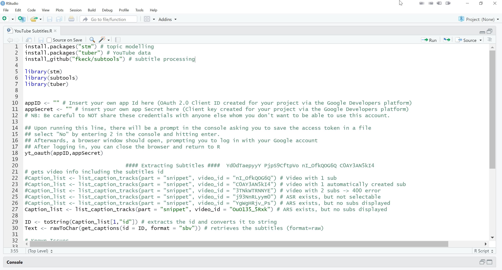

layout: true

```{r child = "./content/config/sessions_setup.Rmd"}
```

---


## Retrieving *YouTube* Video Subtitles

Instead of manually transcribing a video, you can retrieve its subtitles via the *YouTube* API.

What research could/would you conduct with video subtitles?

---

## Types of *YouTube* Subtitles

- Videos with automatically created subtitles (<i>ASR</i>)

  - Always in English, even if video language is not English

  - Can be downloaded, but text quality can be bad (especially if translated)

- Videos without any subtitles?

  - There always seems to be an <i>ASR</i>
  
- Videos with more than one set of subtitles

  - Examples: <i>ASR</i> and regular subtitles, more than one language, more than one subtitle for the same language

  - Can be downloaded, but subtitle for analysis must be selected

---

## Disclaimer

Due to a change in the *YouTube* API, the `tuber` function for retrieving video subtitles only works for videos that were created with the same account as the app used for the API access (see this [closed `tuber` issue on GitHub](https://github.com/soodoku/tuber/issues/78)). We will still discuss this function because it has other useful features, but recommend that you use the [`youtubecaption` package](https://github.com/jooyoungseo/youtubecaption) for collecting subtitles for videos that you have not created yourself. 

We will still briefly show you an example of collecting comments with `tuber` here as using `youtubecaption` requires a working installation of [*Anaconda*](https://www.anaconda.com/products/individual) on your computer. 
  
---

## Retrieving Video Subtitles with `tuber`

First, we need to get the list of subtitles for a video.

```{r caption-list, eval=FALSE}
library(tuber)

caption_list <- list_caption_tracks(video_id = "nI_OfkQOG6Q")
```

*Note*: The `tuber` function `list_caption_tracks()` has an API quota cost ~ 50.

---

## Retrieving Video Subtitles with `tuber`

Next, we need to get the ID of the subtitles we want to collect.

```{r caption-id, eval=FALSE}
ID <- caption_list[1,"id"]
```
  
*Note*: You can adapt the number to select the subtitle that you want (ASR = automatic sub)

---

## Retrieving Video Subtitles with `tuber`

After that, we need to retrieve the subtitles and convert them from raw to char.

```{r rawtochar, eval=FALSE}
text <- rawToChar(get_captions(id = ID, format = "sbv"))
```

Now we can save the subtitles to a subtitle file.

```{r write-file, eval=FALSE}
write(text, file = "Captions.sbv", sep="\n")
```

---

## Converting Subtitles

- Subtitles come in a special format called SBV

- The format contains time stamps etc. that we do not need for text analysis

- We can read the format with the package [`subtools`](https://github.com/fkeck/subtools)

---

## Converting Subtitles

```{r read-subs, eval=FALSE}
library(subtools)

subs <- read_subtitles("Captions.sbv", format = "subviewer")
```
 
With `subtools`, we can also retrieve the text from the subtitles.

```{r get-text, eval=FALSE}
subtext <- get_raw_text(subs)
```

Now the text is ready for further analysis (see the previous sessions for examples).

---

## Retrieving Video Subtitles with `youtubecaption`

- **Pros**:

  - No credentials necessary, therefore no quota reduction
  
  - Subtitles are automatically converted into a dataframe including texts and timestamps, so no manual conversion is needed
  
- **Cons**:

  - If there is more than one subtitle version per language, there is no way to select a specific one
  
  - You need to install [*Anaconda*](https://www.anaconda.com/products/individual)

---

## Retrieving Video Subtitles with `YouTube Summary with ChatGPT`

You can also manually retrieve subtitles with the Chrome plugin [YouTube Summary with ChatGPT](https://chrome.google.com/webstore/detail/youtube-summary-with-chat/nmmicjeknamkfloonkhhcjmomieiodli/related)

- **Pros**:

  - Easy to install, easy to use
  
  - Desired subtitle can be selected
  
- **Cons**:

  - Manual copy & paste for each video (no automatization)

  - Subtitles are not in standard format; need to be processed  

---

## Retrieving Video Subtitles with `YouTube Summary with ChatGPT`

We have created an `R` script named `parse_video_transcript.R` that you can use to import video transcripts/subtitles collected using the Chrome plugin [YouTube Summary with ChatGPT](https://chrome.google.com/webstore/detail/youtube-summary-with-chat/nmmicjeknamkfloonkhhcjmomieiodli/related).

Once you have sourced the function, you can use it to import all .txt files from a given directory (provided as the `directory` argument) and process them into a dataframe with different columns/variables for the timestamp, text, video name, video URL, and video ID.

Of course, before you can use the function, you need to create at least one `.txt` file that containing the transcript copied from the [YouTube Summary with ChatGPT](https://chrome.google.com/webstore/detail/youtube-summary-with-chat/nmmicjeknamkfloonkhhcjmomieiodli/related) Chrome plugin. The name(s) of the `.txt` file(s) do not matter, but the transcript/subtitles from each video should be stored in a separate file.

---

## Retrieving Video Subtitles with `YouTube Summary with ChatGPT`

As a side note: You could, potentially, automate the transcript collection via a web scraping approach using [`RSelenium`](https://docs.ropensci.org/RSelenium/) (for an introduction to `RSelenium`, see, e.g., this [tutorial](https://appsilon.com/webscraping-dynamic-websites-with-r/)). Note, however, that we have not tested this and using web scraping with a browser plugin may be tricky.

---

## Time for a Short Live Demo


.small[
**Note**: You can find the code for collecting and processing subtitles for *YouTube* videos in the `YouTubeSubtitles.R` file in the folder `content\R` within the workshop materials.
]

---

class: center, middle

# Any (further) questions?